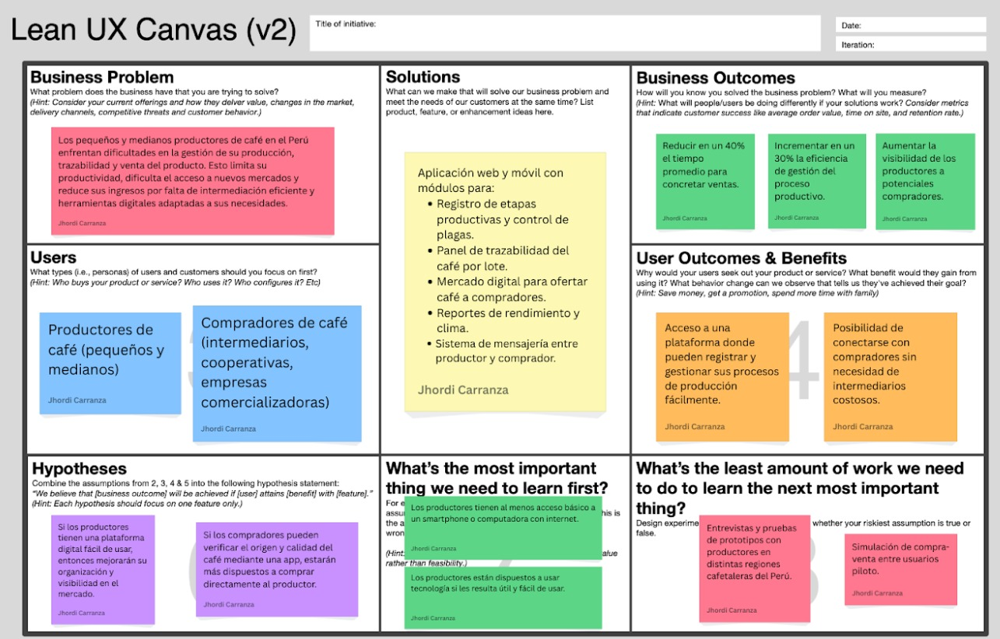

Capítulo I: Introducción

1.1. Startup Profile

1.1.1. Descripción de la Startup

Qahwa es una startup orientada al desarrollo de soluciones digitales para pequeños y medianos productores de café en el Perú. Nuestro objetivo es digitalizar y optimizar todo el proceso productivo del café (desde la preparación del terreno hasta la comercialización del grano) a través de una aplicación web intuitiva y accesible. Buscamos contribuir al crecimiento del sector cafetalero (Recordemos que nuestro país es un importante productor de café en el mundo) brindando herramientas que faciliten el seguimiento de cultivos, el control de cosechas y la mejora en la toma de decisiones comerciales.

1.1.2. Perfiles de integrantes del equipo

1.2. Solution Profile

1.2.1 Antecedentes y problemática

En el Perú, muchos pequeños y medianos productores de café enfrentan grandes desafíos en la gestión de sus procesos agrícolas y comerciales, especialmente en aquellos donde los recursos tecnológicos son limitados o sencillamente no cuentan con ellos. La falta de digitalización de sus cultivos, cosechas y ventas genera pérdidas económicas, baja productividad y una limitada trazabilidad del producto final. Además, los registros manuales son propensos a errores y dificultan la toma de decisiones informadas sobre el negocio cafetalero.

Puntos clave a resolver con la solución:

- Digitalizar el registro de actividades de campo (preparación del terreno, siembra, cosecha, etc.)
- Facilitar el seguimiento de procesos en vivero, cultivo, cosecha y postcosecha.
- Automatizar el control de inventario de sacos y estado de humedad del grano.
- Centralizar la información sobre clientes, ventas y precios del café.
- Generar reportes sobre productividad, estado del cultivo y desempeño comercial.

Objetivos del proyecto:

- Creación de una página web accesible y fácil de usar para productores de café.
- Ofrecer una interfaz clara que pueda ser usada incluso por usuarios sin experiencia.
- Permitir la visualización de reportes e historial de actividades agrícolas.

Restricciones del proyecto:
Nuestro sistema estará enfocado inicialmente en los pequeños productores (sectores rurales del Perú).

1. WHO (¿Quién?)

- Pequeños y medianos productores de café en el Perú, principalmente en zonas rurales de la sierra y ceja de selva.
- También incluye técnicos agrícolas, cooperativas cafetaleras e intermediarios en la cadena de valor del café.

2. WHAT (¿Qué?)

- La problemática central es la falta de digitalización y organización en el seguimiento de las etapas del proceso cafetalero (siembra, cultivo, cosecha, poscosecha y venta).
- Esto genera pérdidas económicas, poca trazabilidad del producto, baja eficiencia y dificultades en la toma de decisiones.

3. WHERE (¿Dónde?)

- En las principales regiones productoras de café en el Perú: Cajamarca, Junín, San Martín, Amazonas, Cusco, entre otras.
- Ámbitos rurales con conectividad media o baja, pero con creciente acceso a dispositivos móviles.

4. WHEN (¿Cuándo?)

- El problema ocurre de forma constante a lo largo de todo el año, especialmente en épocas clave como la siembra (marzo-abril) y la cosecha (mayo a octubre).
- La falta de registros históricos afecta tanto la planificación anual como el seguimiento de cada campaña cafetalera.

5. WHY (¿Por qué?)

- Porque muchos productores siguen usando registros manuales o no registran nada, debido a:
  - Limitado acceso a herramientas tecnológicas adaptadas a su realidad.
  - Falta de capacitación digital.
  - Sistemas existentes demasiado complejos o costosos.

6. HOW (¿Cómo sucede?)

- El productor realiza labores de campo sin una bitácora formal.
- No recuerda fechas exactas de fertilización, poda o tratamientos fitosanitarios.
- Al llegar la cosecha, vende su café sin poder demostrar la calidad del proceso, lo que disminuye su capacidad de negociación en el mercado.
- Las ventas no quedan registradas y se pierde información valiosa para la trazabilidad del producto o evaluación del negocio.

7. HOW MUCH (¿Cuánto afecta?)

- Según el MINAGRI, el 95% de los productores son pequeños agricultores, y muchos de ellos pierden entre 15% y 30% de su producción potencial por mala planificación o manejo técnico deficiente.
- Además, la falta de trazabilidad limita su acceso a mercados premium o exportadores, donde podrían vender su café a precios mucho más altos.

  1.2.2 Lean UX Process.

El enfoque Lean UX aplicado en este proyecto nos ha permitido definir una visión clara del modelo de negocio, identificar con precisión los problemas del usuario y plantear hipótesis que guíen el desarrollo de un sistema centrado en las necesidades reales de los productores cafetaleros.

1.2.2.1. Lean UX Problem Statements.

Domain (Dominio del problema):
El dominio del problema es la gestión de procesos agrícolas y de comercialización en la producción de café peruano, especialmente en manos de pequeños productores con recursos limitados y sin acceso a herramientas digitales especializadas.

Customer Segments (Segmentos de clientes): - Pequeños productores de café. - Técnicos agrícolas y asociaciones/cooperativas cafetaleras. - Intermediarios y compradores.

Pain Points (Puntos de dolor): - Falta de digitalización en el control de procesos agrícolas. - Escasa trazabilidad de la producción de café. - Dificultades para registrar y analizar actividades agrícolas. - Pérdida de oportunidades comerciales por no demostrar calidad del café.

Gap (Brecha identificada):
Existe una desconexión entre el potencial del café peruano y la forma en que se gestiona su producción y venta, debido a la ausencia de herramientas tecnológicas simples, accesibles y adaptadas al entorno rural.

Vision / Strategy:
Desarrollar una plataforma web accesible y fácil de usar, que permita a los caficultores registrar, organizar y monitorear todo el ciclo de producción y comercialización de su café, desde la siembra hasta la venta, fortaleciendo la trazabilidad, eficiencia y el acceso a mercados de valor.

Initial Segment:
Nos enfocaremos inicialmente en productores cafetaleros de la región Cajamarca, que representan uno de los focos más importantes de producción nacional y tienen un alto nivel de organización local a través de cooperativas y asociaciones.

1.2.2.2. Lean UX Assumptions.

- Los productores cafetaleros están interesados en mejorar la gestión de sus cultivos y ventas.
- La mayoría cuenta con acceso a un celular con internet o a centros de conectividad cercanos.
- Prefieren soluciones simples, visuales y adaptadas a su nivel de alfabetización digital.
- Las cooperativas o técnicos agrícolas pueden cumplir un rol clave en la adopción inicial del sistema.
- Existe mercado para el café con trazabilidad comprobada.

  1.2.2.3. Lean UX Hypothesis Statements.

- Si brindamos una plataforma web fácil de usar para registrar las actividades agrícolas, los productores cafetaleros podrán llevar un mejor control de su producción y reducir pérdidas por desorganización.
- Si los productores pueden demostrar la trazabilidad de su café, tendrán más oportunidades para acceder a mercados con mejores precios.
- Si los técnicos agrícolas pueden supervisar múltiples parcelas desde el sistema, se optimizará la asistencia técnica y el rendimiento productivo.
- Si los compradores tienen acceso a información detallada de cada lote de café, confiarán más en el producto y establecerán relaciones comerciales más directas y justas.

  1.2.2.4. Lean UX Canvas.

1.3. Segmentos objetivo.

Segmento 1: Pequeños productores de Café
Descripción: agricultores que cultivan café de forma tradicional y familiar.
Características demográficas:
Edad: 25 - 50 años.
Nivel educativo: en su mayoría primaria y secundaria
Ubicación: zonas rurales de la sierra y parte de selva, como Cajamarca, San Martín, Junín y Cuzco.
Conectividad: acceso limitado a internet, pero creciente uso de celulares con navegadores web.

Segmento 2:

Capítulo II: Requirements Elicitation & Analysis

2.1. Competidores.

2.1.1. Análisis competitivo.

2.1.2. Estrategias y tácticas frente a competidores.

2.2. Entrevistas.

2.2.1. Diseño de entrevistas.

2.2.2. Registro de entrevistas.

2.2.3. Análisis de entrevistas.

2.3. Needfinding.

2.3.1. User Personas.

2.3.2. User Task Matrix.

2.3.3. User Journey Mapping.

2.3.4. Empathy Mapping.

2.3.5. As-is Scenario Mapping.

2.4. Ubiquitous Language.

Capítulo III: Requirements Specification

3.1. To-Be Scenario Mapping.

3.2. User Stories.

3.3. Impact Mapping.

3.4. Product Backlog.
