
<strong>Universidad Peruana de Ciencias Aplicadas</strong>

<strong>Ingeniería de Software</strong> 
Aplicaciones Web  
<strong>Profesor:</strong> Sánchez Ponce, Alex Humberto 

<h2 align="center">INFORME</h2>

<h3 align="center">Startup: ChabeCode</h3>

<strong>Producto: SplitEasy</strong>

<h3 align="center">Team Members:</h3>

| **Member**                           | **Code**     |
|--------------------------------------|--------------|
|Jhordi Luis Carranza Pérez      |  U20191835  |
|João Otavio de Carvalho Saito         |  U202020107 |
|Esteban Valentino Alvarez Falen  |          |

# Capítulo I: Introducción

## 1.1 Startup Profile

### 1.1.1 Descripción de la Startup

**Qahwa** es una startup orientada al desarrollo de soluciones digitales para pequeños y medianos productores de café en el Perú. Nuestro objetivo es digitalizar y optimizar todo el proceso productivo del café (desde la preparación del terreno hasta la comercialización del grano) a través de una aplicación web intuitiva y accesible.

Buscamos contribuir al crecimiento del sector cafetalero —recordemos que nuestro país es un importante productor de café en el mundo— brindando herramientas que faciliten el seguimiento de cultivos, el control de cosechas y la mejora en la toma de decisiones comerciales.

### 1.1.2 Perfiles de integrantes del equipo

## Estudiantes de Ingeniería de Software

### 1. Jhordi Luis Carranza Pérez
- **Código de estudiante**: U20191835
- **Carrera**: Ingeniería de Software
- **Descripción**: Soy una persona que me gusta cumplir con mis obligaciones de manera efectiva, aunque muchas veces me descuide un poco. Mis conocimientos técnicos van en torno a Programación Web, bases de datos, lenguajes de alto y bajo rendimiento como C++, Python y JavaScript.

### 2. João Otavio de Carvalho Saito
- **Código de estudiante**: U202020107
- **Carrera**: Ingeniería de Software
- **Descripción**: Soy una persona dedicada, activa y determinada. Muchas veces me sobrecargo de cosas que hacer y termino descuidando los detalles. Tengo conocimientos en C++, Python, Unity y modelado 3D.

### 3. Esteban Valentino Alvarez Falen
- **Carrera**: Ingeniería de Software
- **Descripción**: Soy Esteban Valentino Alvarez Falen, estudiante de la UPC en la carrera de Ingeniería de Software. Me encantan los videojuegos y la música. Espero terminar a futuro mis metas y lograr todo con satisfacción.

## 1.2 Solution Profile

### 1.2.1 Antecedentes y problemática

En el Perú, muchos pequeños y medianos productores de café enfrentan grandes desafíos en la gestión de sus procesos agrícolas y comerciales, especialmente en aquellos donde los recursos tecnológicos son limitados o sencillamente no cuentan con ellos. La falta de digitalización de sus cultivos, cosechas y ventas genera pérdidas económicas, baja productividad y una limitada trazabilidad del producto final. Además, los registros manuales son propensos a errores y dificultan la toma de decisiones informadas sobre el negocio cafetalero.

#### Puntos clave a resolver con la solución:

- Digitalizar el registro de actividades de campo (preparación del terreno, siembra, cosecha, etc.)
- Facilitar el seguimiento de procesos en vivero, cultivo, cosecha y postcosecha.
- Automatizar el control de inventario de sacos y estado de humedad del grano.
- Centralizar la información sobre clientes, ventas y precios del café.
- Generar reportes sobre productividad, estado del cultivo y desempeño comercial.

#### Objetivos del proyecto:

- Creación de una página web accesible y fácil de usar para productores de café.
- Ofrecer una interfaz clara que pueda ser usada incluso por usuarios sin experiencia.
- Permitir la visualización de reportes e historial de actividades agrícolas.

#### Restricciones del proyecto:

- Nuestro sistema estará enfocado inicialmente en los pequeños productores (sectores rurales del Perú).

### 1.2.2 Análisis 5W2H

#### 1. WHO (¿Quién?)

Pequeños y medianos productores de café en el Perú, principalmente en zonas rurales de la sierra y ceja de selva.  
También incluye técnicos agrícolas, cooperativas cafetaleras e intermediarios en la cadena de valor del café.

#### 2. WHAT (¿Qué?)

La problemática central es la falta de digitalización y organización en el seguimiento de las etapas del proceso cafetalero (siembra, cultivo, cosecha, poscosecha y venta).  
Esto genera pérdidas económicas, poca trazabilidad del producto, baja eficiencia y dificultades en la toma de decisiones.

#### 3. WHERE (¿Dónde?)

En las principales regiones productoras de café en el Perú: Cajamarca, Junín, San Martín, Amazonas, Cusco, entre otras.  
Ámbitos rurales con conectividad media o baja, pero con creciente acceso a dispositivos móviles.

#### 4. WHEN (¿Cuándo?)

El problema ocurre de forma constante a lo largo de todo el año, especialmente en épocas clave como la siembra (marzo-abril) y la cosecha (mayo a octubre).  
La falta de registros históricos afecta tanto la planificación anual como el seguimiento de cada campaña cafetalera.

#### 5. WHY (¿Por qué?)

Porque muchos productores siguen usando registros manuales o no registran nada, debido a:

- Limitado acceso a herramientas tecnológicas adaptadas a su realidad.
- Falta de capacitación digital.
- Sistemas existentes demasiado complejos o costosos.

#### 6. HOW (¿Cómo sucede?)

- El productor realiza labores de campo sin una bitácora formal.
- No recuerda fechas exactas de fertilización, poda o tratamientos fitosanitarios.
- Al llegar la cosecha, vende su café sin poder demostrar la calidad del proceso, lo que disminuye su capacidad de negociación en el mercado.
- Las ventas no quedan registradas y se pierde información valiosa para la trazabilidad del producto o evaluación del negocio.

#### 7. HOW MUCH (¿Cuánto afecta?)

Según el MINAGRI, el 95% de los productores son pequeños agricultores, y muchos de ellos pierden entre 15% y 30% de su producción potencial por mala planificación o manejo técnico deficiente.  
Además, la falta de trazabilidad limita su acceso a mercados premium o exportadores, donde podrían vender su café a precios mucho más altos.

### 1.2.2 Lean UX Process

El enfoque Lean UX aplicado en este proyecto nos ha permitido definir una visión clara del modelo de negocio, identificar con precisión los problemas del usuario y plantear hipótesis que guíen el desarrollo de un sistema centrado en las necesidades reales de los productores cafetaleros.

#### 1.2.2.1 Lean UX Problem Statements

**Domain (Dominio del problema)**  
El dominio del problema es la gestión de procesos agrícolas y de comercialización en la producción de café peruano, especialmente en manos de pequeños productores con recursos limitados y sin acceso a herramientas digitales especializadas.

**Customer Segments (Segmentos de clientes)**  
- Pequeños productores de café  
- Técnicos agrícolas y asociaciones/cooperativas cafetaleras  
- Intermediarios y compradores  

**Pain Points (Puntos de dolor)**  
- Falta de digitalización en el control de procesos agrícolas  
- Escasa trazabilidad de la producción de café  
- Dificultades para registrar y analizar actividades agrícolas  
- Pérdida de oportunidades comerciales por no demostrar calidad del café  

**Gap (Brecha identificada)**  
Existe una desconexión entre el potencial del café peruano y la forma en que se gestiona su producción y venta, debido a la ausencia de herramientas tecnológicas simples, accesibles y adaptadas al entorno rural.

**Vision / Strategy**  
Desarrollar una plataforma web accesible y fácil de usar, que permita a los caficultores registrar, organizar y monitorear todo el ciclo de producción y comercialización de su café, desde la siembra hasta la venta, fortaleciendo la trazabilidad, eficiencia y el acceso a mercados de valor.

**Initial Segment**  
Nos enfocaremos inicialmente en productores cafetaleros de la región Cajamarca, que representan uno de los focos más importantes de producción nacional y tienen un alto nivel de organización local a través de cooperativas y asociaciones.

#### 1.2.2.2 Lean UX Assumptions

- Los productores cafetaleros están interesados en mejorar la gestión de sus cultivos y ventas.  
- La mayoría cuenta con acceso a un celular con internet o a centros de conectividad cercanos.  
- Prefieren soluciones simples, visuales y adaptadas a su nivel de alfabetización digital.  
- Las cooperativas o técnicos agrícolas pueden cumplir un rol clave en la adopción inicial del sistema.  
- Existe mercado para el café con trazabilidad comprobada.  

#### 1.2.2.3 Lean UX Hypothesis Statements

- Si brindamos una plataforma web fácil de usar para registrar las actividades agrícolas, los productores cafetaleros podrán llevar un mejor control de su producción y reducir pérdidas por desorganización.  
- Si los productores pueden demostrar la trazabilidad de su café, tendrán más oportunidades para acceder a mercados con mejores precios.  
- Si los técnicos agrícolas pueden supervisar múltiples parcelas desde el sistema, se optimizará la asistencia técnica y el rendimiento productivo.  
- Si los compradores tienen acceso a información detallada de cada lote de café, confiarán más en el producto y establecerán relaciones comerciales más directas y justas.

#### 1.2.2.4. Lean UX Canvas

  

## 1.3. Segmentos objetivos

**Segmento 1: Pequeños productores de Café**  
**Descripción:** Agricultores que cultivan café de forma tradicional y familiar.

**Características demográficas:**  
- **Edad:** 25 - 50 años  
- **Nivel educativo:** En su mayoría primaria y secundaria  
- **Ubicación:** Zonas rurales de la sierra y parte de selva, como Cajamarca, San Martín, Junín y Cuzco.  
- **Conectividad:** Acceso limitado a internet, pero creciente uso de celulares con navegadores web.  

**Segmento 2: Compradores**  
**Descripción:** Personas o empresas que adquieren café directamente del productor o a través de cooperativas, para su posterior comercialización o exportación.

**Características demográficas:**  
- **Edad:** 30 a 55 años  
- **Ubicación:** Zonas comerciales o urbanas cercanas a los centros de producción.  
- **Conectividad:** Buena infraestructura tecnológica.

# Capítulo II: Requirements Elicitation & Analysis

## 2.1. Competidores

En el análisis de mercado hemos identificado una serie de competidores que ofrecen soluciones digitales enfocadas en la gestión agrícola o en la cadena de comercialización del café. A continuación, presentamos tres de los principales competidores directos e indirectos, junto con una breve descripción de sus modelos de negocio y su relación con el dominio de nuestro proyecto:

### 1. Agrovision
**Tipo**: Competidor directo  
**Descripción**:  
Plataforma digital orientada al monitoreo y gestión de cultivos agrícolas. Permite registrar actividades de campo, generar reportes de productividad y controlar plagas y enfermedades mediante sensores y aplicaciones móviles.  
**Relación con el proyecto**:  
Tiene funciones de monitoreo agrícola, similares a las que proponemos, aunque enfocadas principalmente en grandes empresas agroexportadoras. No está adaptada a pequeños productores cafetaleros ni considera el proceso de comercialización.

### 2. Digital Coffee Future
**Tipo**: Competidor directo  
**Descripción**:  
Startup internacional que busca digitalizar la cadena de valor del café. Ofrece soluciones para rastrear la producción desde el campo hasta el comprador final, con enfoque en trazabilidad, sostenibilidad y comercio justo.  
**Relación con el proyecto**:  
Aborda un enfoque similar al nuestro, pero su alcance es global y se enfoca en exportadores y empresas con mayor capacidad tecnológica. Nuestro sistema se diferencia por centrarse en productores locales peruanos con herramientas más sencillas y accesibles.

### 3. Jiwa+ (de Rikolto)
**Tipo**: Competidor indirecto  
**Descripción**:  
Aplicación desarrollada en colaboración con asociaciones agrícolas en Perú. Permite llevar un registro de actividades, gestión de parcelas, producción y ventas para pequeños agricultores.  
**Relación con el proyecto**:  
Es una solución que se aproxima al modelo que proponemos, pero aún está en etapas limitadas de adopción. No está especializada en el rubro del café ni ha sido diseñada específicamente para la cadena completa del proceso cafetalero.

### 2.1.1. Análisis competitivo

#### ¿Por qué llevar a cabo este análisis?  
Este análisis busca comprender a fondo el entorno competitivo en el que se posiciona nuestra startup cafetalera, identificando fortalezas y debilidades de los principales actores del mercado. Esto permitirá afinar nuestra propuesta de valor, descubrir oportunidades de diferenciación y definir una estrategia competitiva efectiva.

| Categoría                | Nuestra Startup (Qahwa)                                | Agrovisión (Competidor)                           | Digital Coffee Future (Competidor)               | Jiwa+ (Competidor)                                |
|--------------------------|--------------------------------------------------------|--------------------------------------------------|-------------------------------------------------|---------------------------------------------------|
| **Perfil Overview**       | Plataforma de gestión del café desde el cultivo hasta la venta, enfocada en productores peruanos. | Plataforma de monitoreo y gestión agrícola para agroexportadores. | Solución de trazabilidad digital para la cadena global del café. | App para gestión de actividades agrícolas locales. |
| **Ventaja competitiva**   | Integración completa y simple para cafetaleros locales. | Gestión agrícola con sensores y reportes avanzados. | Transparencia en la cadena de valor para exportadores. | Acompañamiento a asociaciones rurales.           |
| **Mercado objetivo**      | Pequeños y medianos caficultores peruanos.             | Grandes empresas agroindustriales.               | Empresas exportadoras y compradores internacionales. | Agricultores rurales organizados en asociaciones. |
| **Estrategias de marketing** | Capacitación, ferias agrícolas, asociaciones cafetaleras. | Venta directa a empresas y uso de redes de distribuidores. | Alianzas internacionales, enfoque en sostenibilidad. | ONG y redes locales de confianza.                 |
| **Productos & Servicios** | Gestión de cultivo, cosecha, procesamiento, ventas y stock. | Sensores, reportes de productividad, control fitosanitario. | Plataforma de trazabilidad, reportes, certificaciones. | Registro de actividades, gestión de parcelas.      |
| **Precios & Costos**      | Modelo freemium con pagos por funciones avanzadas.     | Costos altos, orientado a empresas con presupuesto. | Precio en función del tamaño y nivel de exportación. | Bajo costo, subsidiado por ONG.                   |
| **Canales de distribución** | Web y aplicación móvil adaptada a zonas rurales.      | Web + plataforma en la nube.                     | Web, móvil y API para integraciones.             | Aplicación móvil offline.                         |

#### Análisis SWOT

| Categoría               | Nuestra Startup (Qahwa)                                | Agrovision (Competidor)                           | Digital Coffee Future (Competidor)               | Jiwa+ (Competidor)                                |
|-------------------------|--------------------------------------------------------|--------------------------------------------------|-------------------------------------------------|---------------------------------------------------|
| **Fortalezas**           | Adaptada al cafetalero peruano, interfaz sencilla, bajo costo. | Alta tecnología, sensores, informes técnicos.     | Experiencia global, fuerte enfoque en trazabilidad. | Apoyo comunitario, diseñada para asociaciones.    |
| **Debilidades**          | Poco reconocimiento inicial, recursos limitados.      | No está diseñada para pequeños productores.       | Requiere conectividad y conocimientos digitales.  | Alcance limitado a ciertas zonas rurales.         |
| **Oportunidades**        | Alta demanda de digitalización en cafetaleros locales, apoyo estatal. | Expansión a nuevos cultivos.                      | Certificaciones ecológicas y comercio justo.      | Escalamiento a otras regiones agrícolas.          |
| **Amenazas**             | Entrada de nuevas startups, resistencia tecnológica en zonas rurales. | Saturación de tecnologías avanzadas.              | Cambios regulatorios o falta de adopción local.   | Dependencia de subvenciones y ONG.                |

### 2.1.2. Estrategias y tácticas frente a competidores.

Para enfrentar las fortalezas y debilidades de los competidores, así como aprovechar el contexto de oportunidades y amenazas, nuestra startup Qahwa aplicará las siguientes estrategias y tácticas:

#### Diferenciación basada en accesibilidad y enfoque local:
- Desarrollar una interfaz sencilla y amigable incluso para caficultores con bajo nivel de alfabetización digital.
- Brindar soporte técnico y capacitaciones personalizadas en zonas rurales, en alianza con cooperativas cafetaleras.

#### Alianzas estratégicas:
- Colaborar con ONG, municipios rurales y programas del Estado para facilitar la implementación del sistema.
- Buscar convenios con asociaciones de cafetaleros para crear redes de usuarios beta que validen y promuevan la solución.

#### Modelo de negocio adaptable y escalable:
- Implementar un modelo freemium que permita adopción inicial sin costos, con mejoras pagadas según necesidades.
- Diseñar funciones modulares que puedan escalar conforme crezcan los negocios de los productores.

#### Marketing dirigido y presencia comunitaria:
- Participar en ferias agrícolas, talleres y eventos rurales para generar confianza y visibilidad.
- Generar contenido educativo sobre buenas prácticas cafetaleras integradas al uso de la app.

#### Monitoreo continuo del mercado y ajustes estratégicos:
- Realizar retroalimentación constante con usuarios para adaptar el producto a sus cambios de contexto.
- Monitorear innovaciones tecnológicas de competidores para evaluar adaptaciones necesarias.

Con estas estrategias, Qahwa busca posicionarse como una solución integral, accesible y confiable para los caficultores peruanos, transformando digitalmente su cadena de valor con enfoque local y comunitario.

## 2.2. Entrevistas.

### 2.2.1. Diseño de entrevistas.

#### Segmento 1: Productores de café
**Objetivo**: Conocer a fondo sus procesos, retos, herramientas actuales, necesidades, perfil demográfico y digital.

**Información a recolectar**:
- Edad, género, distrito o zona rural de residencia, ocupación, años de experiencia.
- Objetivos, frustraciones, nivel de digitalización, canales de venta, dispositivos que usa.
- Estilo de vida, nivel de educación, influencias.

**Preguntas principales**:
1. ¿Cuántos años lleva produciendo café?
2. ¿Cómo es el proceso que sigue desde la siembra hasta la venta del café?
3. ¿Qué herramientas usa actualmente para gestionar sus cultivos y ventas?
4. ¿Con qué frecuencia enfrenta problemas relacionados al manejo de plagas o clima?
5. ¿Cómo realiza actualmente sus ventas? ¿A quién le vende y cómo negocia precios?
6. ¿Qué tan fácil o difícil le resulta encontrar compradores?
7. ¿Usa algún tipo de tecnología (apps, redes sociales, hojas de cálculo)?
8. ¿Cuáles son sus principales preocupaciones o frustraciones en el proceso de producción y comercialización?

**Preguntas complementarias**:
1. ¿Ha recibido capacitaciones o asistencia técnica en los últimos años?
2. ¿Qué medio usa más: celular, laptop, radio, etc.?
3. ¿Qué haría si tuviera una herramienta digital para mejorar sus ventas y gestión?
4. ¿Qué canales digitales (WhatsApp, Facebook, etc.) usa con más frecuencia?
5. ¿Tiene acceso a internet con frecuencia? ¿Qué tan bueno es ese acceso?

#### Segmento 2: Compradores
**Objetivo**: Entender cómo compran, qué valoran del producto, su perfil de compra, necesidades digitales y relación con los productores.

**Información a recolectar**:
- Edad, género, ubicación, tipo de empresa o negocio.
- Canales y criterios de compra, herramientas digitales usadas, frustraciones.
- Personalidad, objetivos, marca preferida, experiencia en el rubro.

**Preguntas principales**:
1. ¿A qué tipo de productores suele comprar café?
2. ¿Cómo identifica o contacta a nuevos proveedores?
3. ¿Qué aspectos valora más al momento de comprar café? (Precio, calidad, origen, certificación, etc.)
4. ¿Qué dificultades enfrenta al negociar o cerrar una venta?
5. ¿Qué herramientas usa para gestionar sus compras y contactos?
6. ¿Ha tenido problemas con la trazabilidad o calidad del café que adquiere?
7. ¿Qué espera de una solución digital que facilite su proceso de compra?

**Preguntas complementarias**:
1. ¿Con qué frecuencia compra café y en qué volumen?
2. ¿Usa algún sistema o app para gestionar proveedores?
3. ¿Estaría dispuesto a usar una plataforma que conecte directamente con pequeños productores?
4. ¿Qué canales digitales usa más? (Correo, WhatsApp, páginas web, apps)

### 2.2.2. Registro de entrevistas.

Primer segmento Objetivo:

  

https://upcedupe-my.sharepoint.com/personal/u20191e835_upc_edu_pe/_layouts/15/stream.aspx?id=%2Fpersonal%2Fu20191e835%5Fupc%5Fedu%5Fpe%2FDocuments%2FEntrevista%20a%20Productor%20%2D%20By%20Jhordi%20Carranza%2Emp4&referrer=StreamWebApp%2EWeb&referrerScenario=AddressBarCopied%2Eview%2Ebf5a4b4c%2Da522%2D4a35%2D859a%2D2d1a7e388060&isDarkMode=false

Segundo segmento Objetivo:

  

https://upcedupe-my.sharepoint.com/:f:/g/personal/u202315628_upc_edu_pe/EvuPCAPfGQZCqRt3wJYFIJUBGucW25qY1Qk1_dlq5M7lRA?e=fuksvP

### 2.2.3. Análisis de entrevistas.

## 2.3. Needfinding.

### 2.3.1. User Personas.

El objetivo de estos arquetipos es representar de manera empática a nuestros usuarios clave y guiar el diseño centrado en sus necesidades reales. Los User Personas nos permitirán tomar decisiones de diseño, funcionalidades y estrategias alineadas con las motivaciones, frustraciones, habilidades tecnológicas y hábitos de cada perfil.

#### Primer Segmento Objetivo:

  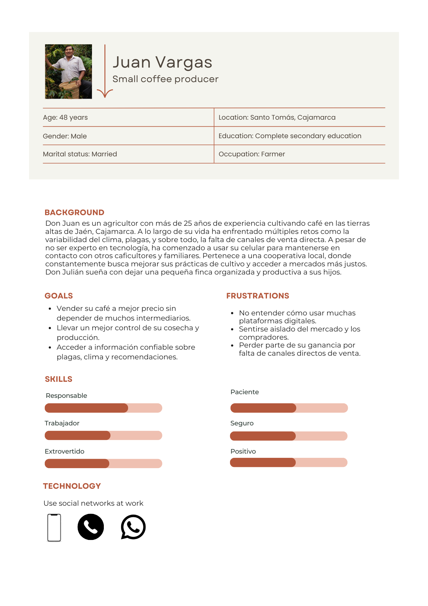

#### Segundo Segmento Objetivo:

  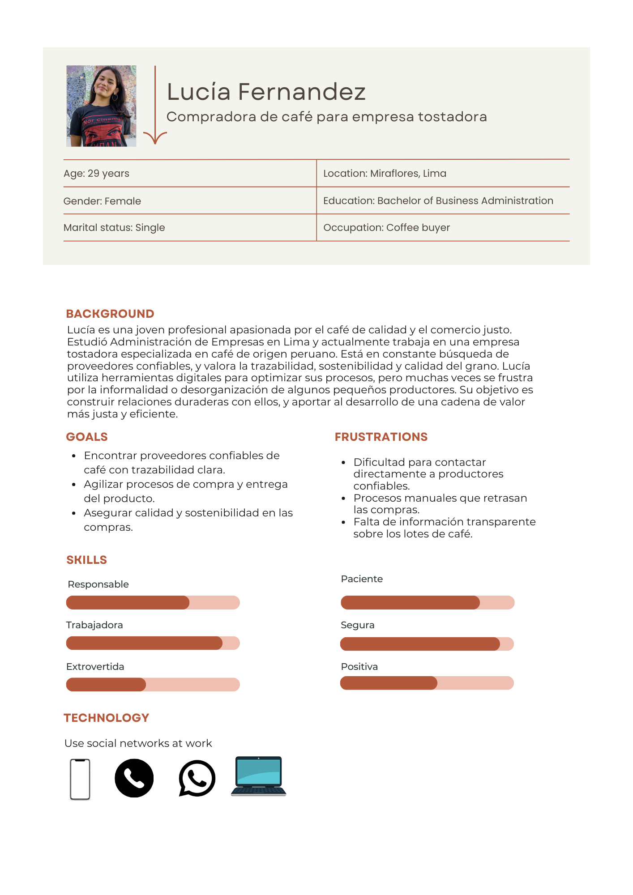

### 2.3.2. User Task Matrix.

Para el desarrollo de esta matriz de tareas, se han considerado los dos segmentos objetivo representados en los User Persona:
- **Don Juan Ramos**: pequeño productor de café de la sierra peruana.
- **Lucía Fernández**: compradora para una empresa tostadora de café de especialidad.

El objetivo de esta matriz es identificar qué tareas realizan estos perfiles en relación con la producción y venta de café, evaluando la frecuencia y la importancia de dichas tareas, de forma independiente a la existencia de una solución digital. Esta información nos permitirá comprender mejor sus prioridades y necesidades reales, y servirá de guía para el diseño del producto.

## 2.3.2. User Task Matrix

| Tarea                                         | Don Juan Ramos (Productor) | Frecuencia | Importancia | Lucía Fernández (Compradora)      | Frecuencia | Importancia |
|----------------------------------------------|-----------------------------|------------|-------------|-----------------------------------|------------|-------------|
| Preparar el terreno y sembrar café           | Sí                          | Alta       | Alta        | No                                | —          | —           |
| Cuidar y monitorear el cultivo               | Sí                          | Alta       | Alta        | No                                | —          | —           |
| Realizar la cosecha                          | Sí                          | Alta       | Alta        | No                                | —          | —           |
| Procesar el café (lavado, secado, etc.)      | Sí                          | Alta       | Alta        | Sí (post-compra)                  | Media      | Alta        |
| Empaquetar y almacenar el café               | Sí                          | Media      | Alta        | Sí                                | Media      | Alta        |
| Buscar canales de venta                      | Sí                          | Alta       | Alta        | Sí                                | Alta       | Alta        |
| Negociar precios con compradores/productores | Sí                          | Media      | Alta        | Sí                                | Alta       | Alta        |
| Transportar el café a puntos de venta        | Sí                          | Media      | Media       | No                                | —          | —           |
| Usar redes y plataformas digitales           | Sí                          | Baja       | Media       | Sí                                | Alta       | Alta        |
| Verificar calidad y procedencia del café     | Sí                          | Media      | Alta        | Sí                                | Alta       | Alta        |
| Hacer seguimiento postventa o reclamos       | Sí                          | Baja       | Media       | Sí                                | Media      | Alta        |
| Contactar nuevos productores/proveedores     | No                          | —          | —           | Sí                                | Alta       | Alta        |
| Realizar visitas técnicas o inspecciones     | No                          | —          | —           | Sí                                | Media      | Alta        |
| Analizar muestras y pruebas de calidad       | No                          | —          | —           | Sí                                | Alta       | Alta        |
| Investigar tendencias de consumo             | No                          | —          | —           | Sí                                | Media      | Media       |

### 2.3.3. User Journey Mapping

#### Segmento 1:

  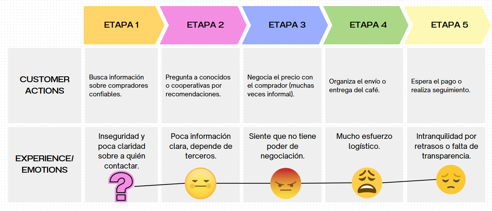

#### Segmento 2:

  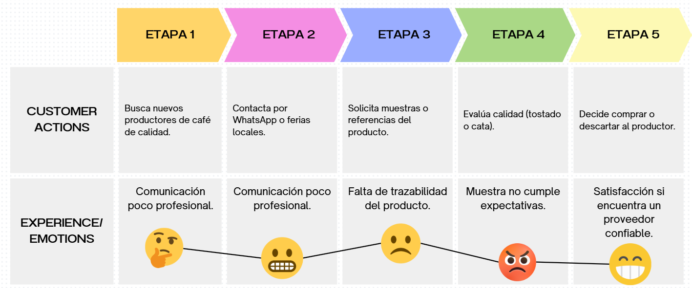

### 2.3.4. Empathy Mapping

  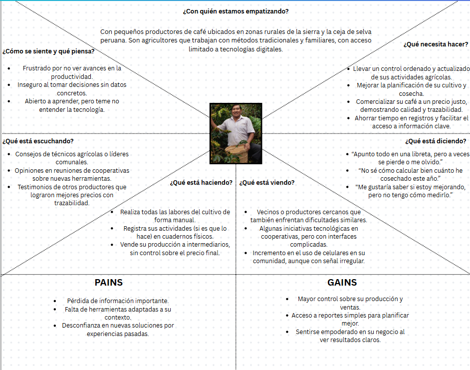

  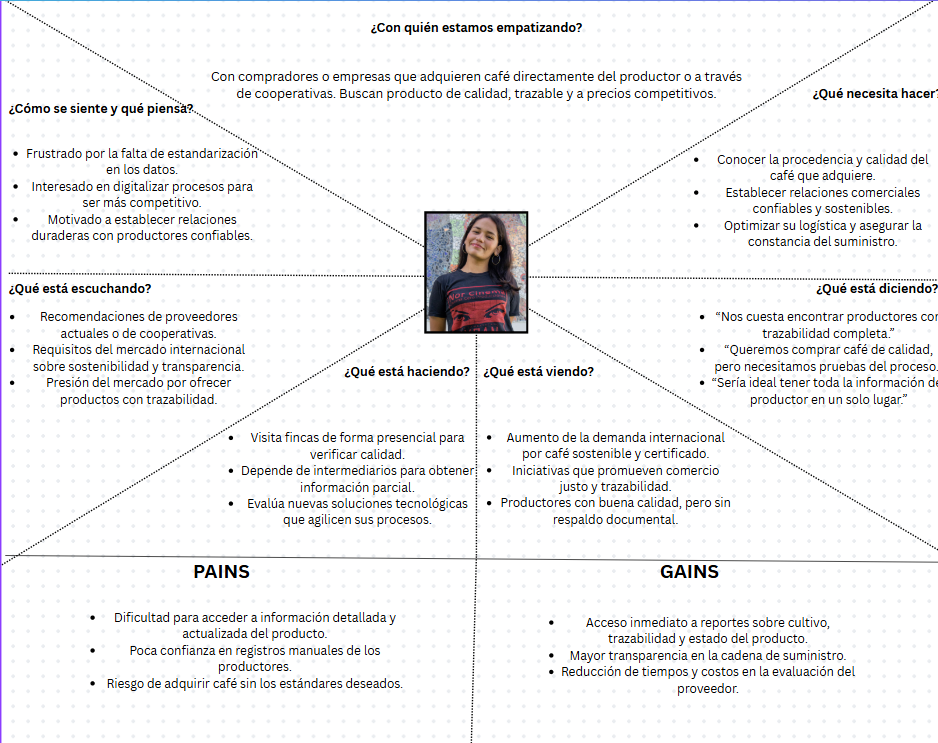

### 2.3.5. As-is Scenario Mapping

## 2.4. Ubiquitous Language

# Capítulo III: Requirements Specification

## 3.1. To-Be Scenario Mapping

## 3.2. User Stories

## 2.3.3. EPICs del Producto Digital

| EPIC ID  | Título                                               | Descripción                                                                                      |
|----------|------------------------------------------------------|--------------------------------------------------------------------------------------------------|
| EP-001   | Digitalizar y gestionar su producción de café        | Como productor, quiero registrar, visualizar y hacer seguimiento de todas las etapas del proceso de producción del café. |
| EP-002   | Conectar con compradores y ofrecer su café           | Como productor, quiero crear perfiles, mostrar mis productos y ofrecerlos directamente a compradores comerciales. |
| EP-003   | Monitorear métricas clave de calidad y rendimiento   | Como productor, quiero visualizar indicadores sobre la calidad del café y la eficiencia en cada etapa del proceso. |
| EP-004   | Gestionar inventario y trazabilidad del café         | Como productor, quiero llevar control del inventario disponible y rastrear cada lote desde el origen. |
| EP-005   | Recibir retroalimentación de los compradores         | Como productor, quiero acceder a opiniones y calificaciones para entender cómo los compradores perciben la calidad de mi café. |
| EP-006   | Acceder a soporte y recursos de aprendizaje          | Como productor, quiero contar con asistencia técnica y recursos educativos sobre producción, calidad y comercialización. |
| EP-007   | Personalizar su perfil y contar su historia          | Como productor, quiero compartir mi historia, ubicación, métodos y filosofía de cultivo. |
| EP-008   | Descubrir y adquirir café directamente de productores| Como comprador, quiero explorar diferentes ofertas de café de productores certificados y realizar compras seguras. |
| EP-009   | Evaluar y comparar productores de café               | Como comprador, quiero calificar la experiencia comercial y comparar diferentes productores para tomar decisiones informadas. |
| EP-010   | Conocer la historia y proceso de producción del café | Como comprador, quiero acceder al perfil del productor y entender el origen, prácticas y calidad del café que adquiero. |
| EP-011   | Recibir recomendaciones según necesidades comerciales | Como comprador, quiero obtener sugerencias de productores o variedades de café alineadas con mis criterios de calidad, origen y volumen. |
| EP-012   | Gestionar pedidos y hacer seguimiento logístico      | Como comprador, quiero ver el estado de mis pedidos, historial y detalles de envío o logística. |
| EP-013   | Acceder a soporte en la relación comercial           | Como comprador, quiero recibir ayuda ante inconvenientes con el producto, entrega o aspectos contractuales. |

| Título | Descripción | Criterios de Aceptación | EPIC ID |
|-------|-------------|-------------------------|---------|
| Registro de etapa de siembra | Como productor, quiero registrar la etapa de siembra para llevar control desde el inicio del proceso productivo. | Scenario 1: Registro exitoso de siembra:  GIVEN un productor logueado WHEN accede al formulario de nueva etapa y completa los campos requeridos THEN la etapa se guarda correctamente en la base de datos AND aparece listada en el cronograma del lote.  Scenario 2: Error por campos vacíos: GIVEN un productor que deja campos obligatorios sin llenar WHEN intenta registrar la etapa THEN la plataforma muestra un mensaje de error AND no permite guardar la información hasta completar los datos. | EP-001 |
| Visualización del cronograma de producción | Como productor, quiero ver un cronograma de las etapas del café para planificar mi trabajo y tiempos. | Scenario 1: Cronograma con etapas registradas: GIVEN que el productor tiene etapas de producción guardadas WHEN accede a la sección de cronograma THEN se muestra una línea de tiempo con las etapas ordenadas por fecha AND cada etapa es clickeable para ver más detalles.  Scenario 2: Cronograma vacío: GIVEN que el productor aún no ha registrado ninguna etapa WHEN accede a la sección de cronograma THEN la plataforma muestra un mensaje indicando que no hay datos AND sugiere registrar una nueva etapa. | EP-001 |
| Edición de etapa de producción | Como productor, quiero modificar la información de una etapa de producción en caso de errores o cambios. | Scenario 1: Edición exitosa de etapa: GIVEN que el productor accede a una etapa previamente registrada WHEN edita los datos y guarda los cambios THEN la información se actualiza correctamente AND se refleja en la vista de cronograma.  Scenario 2: Error por campos inválidos: GIVEN que se ingresan datos en formato incorrecto (por ejemplo, fecha inválida) WHEN intenta guardar THEN la plataforma muestra un mensaje de validación AND evita guardar hasta que el formato sea correcto. | EP-001 |
| Creación de perfil de productor | Como productor, quiero crear un perfil con mi información básica para que los consumidores me conozcan. | Scenario 1: Creación exitosa del perfil: GIVEN que el productor está logueado WHEN completa el formulario de perfil y lo envía THEN el perfil se guarda correctamente AND es visible para los consumidores en su página de productor.  Scenario 2: Campos incompletos: GIVEN que el productor deja campos obligatorios sin llenar WHEN intenta guardar su perfil THEN recibe un mensaje de advertencia AND no puede continuar hasta completarlos. | EP-002 |
| Publicación de café para la venta | Como productor, quiero publicar mis lotes de café para que estén disponibles para la venta. | Scenario 1: Publicación exitosa de café: GIVEN que el productor tiene café disponible WHEN registra un nuevo lote en la plataforma THEN el producto se publica en la vitrina virtual AND los consumidores pueden verlo y comprarlo.  Scenario 2: Error en el registro del producto: GIVEN que se omite información obligatoria como precio o descripción WHEN se intenta guardar THEN el sistema marca los campos faltantes AND no permite completar la publicación. | EP-002 |
| Gestión de pedidos recibidos | Como productor, quiero ver y gestionar los pedidos que me hacen los consumidores. | Scenario 1: Visualización de pedidos activos: GIVEN que existen pedidos en curso WHEN el productor accede a la sección de pedidos THEN puede ver una lista con estado y detalles de cada uno AND acceder a acciones como confirmar envío.  Scenario 2: Sin pedidos aún: GIVEN que el productor no ha recibido pedidos WHEN entra a la sección de pedidos THEN ve un mensaje indicando que aún no tiene pedidos AND se sugiere mejorar visibilidad del producto. | EP-002 |
| Visualización de métricas de calidad | Como productor, quiero ver indicadores de calidad como humedad o tamaño del grano para evaluar mi café. | Scenario 1: Visualización de métricas disponibles: GIVEN que el productor ha registrado datos de calidad WHEN accede al módulo de métricas THEN ve gráficos e indicadores clave por lote AND puede descargarlos si lo desea.  Scenario 2: No hay datos aún: GIVEN que no hay métricas registradas WHEN entra al módulo THEN se muestra una notificación indicando ausencia de datos AND se ofrece un botón para cargar nuevos análisis. | EP-003 |
| EP | Historia | Escenario | GIVEN | WHEN | THEN |
|----|----------|-----------|-------|------|------|
| EP-007 | Publicación de historia y filosofía de cultivo | Historia publicada correctamente | Que el productor escribe su historia | La guarda | Aparece en su perfil público y puede ser leída por los consumidores |
| EP-007 | Publicación de historia y filosofía de cultivo | Texto demasiado corto | Que el texto tiene menos del mínimo requerido | Intenta publicar | La plataforma pide más contenido y no permite guardar |
| EP-007 | Visualización de ubicación y fotos del productor | Información geográfica y fotos visibles | Ha subido imágenes y ubicado su finca | Un consumidor visita su perfil | Puede ver el mapa y fotos en una galería |
| EP-007 | Visualización de ubicación y fotos del productor | Falta de contenido multimedia | No ha subido imágenes ni ubicación | Accede a su perfil | Se sugiere completar información y se ofrece un botón |
| EP-007 | Búsqueda de café por origen o tipo | Búsqueda con resultados | Un comprador logueado | Utiliza filtros por origen y variedad | Se muestran cafés que coinciden |
| EP-007 | Búsqueda de café por origen o tipo | Sin resultados | Filtros demasiado específicos | Realiza búsqueda | Se indica que no hay coincidencias |
| EP-008 | Visualización de perfiles de productores | Acceso a perfiles completos | Un comprador comercial | Selecciona un productor | Se muestra historia, ubicación, métodos y lotes |
| EP-008 | Visualización de perfiles de productores | Perfil incompleto | Productor con datos faltantes | Accede a su perfil | Se muestra advertencia o sección vacía |
| EP-008 | Solicitud de cotización | Envío exitoso de solicitud | Un comprador logueado | Completa formulario de cotización | Se envía la solicitud y queda registrada |
| EP-008 | Solicitud de cotización | Campos obligatorios vacíos | Comprador no llena todos los campos | Intenta enviar | Se muestra mensaje de error |
| EP-009 | Calificación de lotes de café | Calificación exitosa | Comprador que ha adquirido un lote | Accede a opción de calificación | Puede seleccionar puntuación y dejar comentario |
| EP-009 | Calificación de lotes de café | Sin haber realizado compras | Comprador sin compras previas | Intenta calificar | Se muestra mensaje indicando necesidad de compra |
| EP-009 | Compartir reseñas detalladas | Reseña exitosa | Comprador que ha calificado un lote | Escribe una reseña detallada | Se guarda y publica junto con la calificación |
| EP-009 | Compartir reseñas detalladas | Reseña con contenido inapropiado | Comentario ofensivo | Se reporta | Reseña retirada temporalmente para revisión |
| EP-009 | Guardar lotes favoritos | Lote guardado en favoritos | Comprador interesado en un lote | Hace clic en "guardar como favorito" | Lote se guarda en su lista de favoritos |
| EP-009 | Guardar lotes favoritos | Lote eliminado de favoritos | Comprador que ya no está interesado | Elimina lote de favoritos | Ya no aparece en la lista |
| EP-010 | Visualización de historia del productor | Historia visible en el perfil | Comprador comercial logueado | Accede al perfil de un productor | Se muestra historia completa |
| EP-010 | Visualización de historia del productor | Historia incompleta | Productor con historia parcial | Visualiza el perfil | Se indica que la historia está incompleta |
| EP-010 | Información sobre prácticas sostenibles | Prácticas sostenibles mostradas | Comprador interesado en sostenibilidad | Accede a perfil de productor con prácticas descritas | Se muestra apartado detallado |
| EP-010 | Información sobre prácticas sostenibles | Sin información sobre sostenibilidad | Productor sin datos sobre sostenibilidad | Visualiza perfil | Se muestra advertencia o sección vacía |
| EP-010 | Acceso a videos sobre el proceso de producción | Video disponible en el perfil | Productor que ha subido un video | Comprador accede al perfil | Puede ver el video del proceso de producción |
| EP-010 | Acceso a videos sobre el proceso de producción | Video no disponible | Productor sin videos | Accede al perfil | Se indica que no hay videos disponibles |
| EP-011 | Recomendaciones basadas en compras previas | Recomendaciones personalizadas | Comprador con historial de compras | Accede a sección de recomendaciones | Se muestran cafés relacionados |
| EP-011 | Recomendaciones basadas en compras previas | Sin historial de compras | Comprador sin historial | Accede a sección | Se sugiere realizar una compra |
| EP-011 | Recomendaciones basadas en preferencias de tipo de café | Preferencias guardadas correctamente | Comprador que guarda preferencias | Accede a recomendaciones | Se muestran cafés según gustos |
| EP-011 | Recomendaciones basadas en preferencias de tipo de café | Preferencias no configuradas | Comprador sin preferencias definidas | Accede a recomendaciones | Se solicita configurar preferencias |
| EP-011 | Recomendaciones por valoraciones de otros compradores | Recomendaciones por alta valoración | Comprador accede a recomendaciones | Plataforma sugiere productos bien valorados | Cafés recomendados tienen buenas calificaciones |
| EP-011 | Recomendaciones por valoraciones de otros compradores | Recomendaciones sin valoraciones | Cafés sin valoraciones previas | Se muestra recomendación | Se sugieren cafés nuevos o destacados |
| EP-012 | Visualización del historial de pedidos | Historial con pedidos anteriores | Comprador con compras realizadas | Accede a historial | Ve lista de fechas, productos, cantidades y precios |
| EP-012 | Visualización del historial de pedidos | Historial vacío | Comprador sin compras previas | Accede al historial | Plataforma indica que no hay registros |
| EP-012 | Seguimiento del estado de un pedido | Pedido en tránsito | Pedido confirmado | Comprador accede al estado | Se muestra "en preparación", "en tránsito" o "entregado" |
| EP-012 | Seguimiento del estado de un pedido | Información no disponible | Error en sistema de seguimiento | Accede al pedido | Se muestra error y se sugiere contactar soporte |
| EP-012 | Descarga de comprobantes y facturas | Factura disponible para descarga | Pedido finalizado | Accede al detalle del pedido | Puede descargar factura en PDF |
| EP-012 | Descarga de comprobantes y facturas | Pedido sin factura | Pedido no facturado aún | Intenta descargar | Se indica que estará disponible al finalizar el pedido |
| EP-013 | Acceso a soporte en tiempo real | Chat en vivo disponible | Comprador navegando | Necesita ayuda | Puede iniciar chat en vivo |
| EP-013 | Acceso a soporte en tiempo real | Chat fuera de horario | Comprador accede fuera de horario | Solicita soporte | Se muestra mensaje con opciones alternativas |
| EP-013 | Seguimiento de incidencias reportadas | Ver estado de incidencia | Comprador reportó un problema | Accede a sección de soporte | Ve estado y comentarios del equipo |
| EP-013 | Seguimiento de incidencias reportadas | Incidencia sin respuesta | Ticket sin seguimiento | Accede | Puede reenviar solicitud o contactar |
| EP-013 | Acceso a preguntas frecuentes (FAQs) | Consulta de FAQs exitosa | Comprador con duda | Accede a FAQs | Encuentra artículos relevantes |
| EP-013 | Acceso a preguntas frecuentes (FAQs) | No encuentra lo que busca | Duda específica no listada | Busca en FAQs | Se sugiere contactar soporte |

## Impact Mapping

### Impact Mapping para Productores de Café

#### GOAL:
Empoderar a los productores de café para mejorar la calidad, visibilidad y rentabilidad de su producto a través de herramientas digitales.

#### ACTOR: Productor de café

| IMPACTO (Qué cambios buscamos en su comportamiento)                                              | DELIVERABLE (Qué funcionalidades construimos para lograrlo)                                                                 |
|--------------------------------------------------------------------------------------------------|------------------------------------------------------------------------------------------------------------------------------|
| Adoptar herramientas digitales para la gestión diaria de la finca                                | Aplicación web accesible desde celular para registrar actividades por etapa del proceso (EP-001)                            |
| Controlar y optimizar sus recursos e insumos para reducir pérdidas                              | Módulo de inventario con alertas de stock y control por lote (EP-004)                                                       |
| Tener visibilidad sobre la calidad del café y detectar puntos críticos                          | Panel con KPIs por etapa: humedad, tipo de grano, defectos, rendimiento (EP-003)                                            |
| Mostrar su marca y filosofía de forma auténtica y visualmente atractiva                         | Perfil personalizable con multimedia: fotos, historia, métodos, certificaciones (EP-007)                                    |
| Vender directamente sin intermediarios y obtener más margen de ganancia                         | Tienda en línea integrada con su perfil y pasarela de pagos segura (EP-002)                                                 |
| Conocer lo que opinan los consumidores y usarlo para mejorar el producto                        | Sección de feedback con calificaciones por lote, comentarios y tags destacados (EP-005)                                     |
| Acceder a capacitación continua sobre prácticas sostenibles y calidad                          | Biblioteca de recursos filtrada por nivel de experiencia + asistencia técnica remota (EP-006)                               |
| Fortalecer relaciones con clientes mostrando trazabilidad y responsabilidad social              | Trazabilidad visual del lote: origen, prácticas usadas, impacto social o ambiental (EP-004, EP-007 combinados)              |

### Impact Mapping para Consumidores de Café

#### GOAL:
 Conectar a consumidores con café peruano de calidad, permitiéndoles descubrir, comprar y valorar productos directamente desde el origen.
 
#### ACTOR: Consumidor de café

| IMPACTO (Qué deben poder hacer o cambiar)                          | DELIVERABLE (Qué vamos a construir para lograrlo)                                           |
|-------------------------------------------------------------------|---------------------------------------------------------------------------------------------|
| Explorar y comprar café directamente del productor                | Marketplace con filtros, fichas de producto y pasarela de pago (EP-008)                     |
| Dejar reseñas y calificar cafés para otros usuarios               | Sistema de reseñas, calificaciones y favoritos (EP-009)                                     |
| Conocer la historia y el origen del café que consumen             | Acceso al perfil del productor, historia y prácticas (EP-010)                               |
| Recibir recomendaciones personalizadas                            | Algoritmo de sugerencias y panel de preferencias (EP-011)                                   |
| Hacer seguimiento a sus pedidos y ver historial                   | Panel de pedidos con estado, fechas y detalles (EP-012)                                     |
| Obtener soporte si hay problemas con su compra                    | Sistema de soporte: chat, formularios y seguimiento de casos (EP-013)                       |

## 3.4. Product Backlog

| Orden | User Story/Technical Story ID | Título                                           | Descripción                                                                                              | Story Points |
|-------|-------------------------------|--------------------------------------------------|----------------------------------------------------------------------------------------------------------|--------------|
| 1     | US-001-01                     | Registro de etapas de producción                 | Como productor, quiero registrar todas las etapas de producción del café para tener un historial detallado. | 5            |
| 2     | US-002-01                     | Crear perfil del productor                       | Como productor, quiero crear un perfil que incluya mi historia y métodos de cultivo para conectar con los consumidores. | 5            |
| 3     | US-003-01                     | Visualización de métricas de calidad             | Como productor, quiero visualizar indicadores de calidad del café para mejorar mi producción.            | 8            |
| 4     | US-004-01                     | Gestión de inventario y trazabilidad             | Como productor, quiero gestionar mi inventario y asegurarme de que cada lote esté rastreado.             | 8            |
| 5     | US-005-01                     | Acceder a opiniones de los consumidores          | Como productor, quiero acceder a calificaciones y comentarios para entender cómo perciben mi café.       | 3            |
| 6     | US-006-01                     | Acceso a recursos de aprendizaje                 | Como productor, quiero tener acceso a recursos educativos y asistencia técnica sobre la producción de café. | 5            |
| 7     | US-007-01                     | Personalización del perfil                       | Como productor, quiero poder personalizar mi perfil con fotos y detalles sobre mi finca y prácticas.     | 3            |
| 8     | US-008-01                     | Creación de tienda en línea                      | Como productor, quiero crear una tienda en línea para vender mi café directamente a los consumidores.    | 8            |
| 9     | US-008-02                     | Explorar y comprar café                          | Como consumidor, quiero explorar una selección de cafés y comprarlos directamente de los productores.     | 5            |
| 10    | US-009-01                     | Dejar reseñas y calificaciones                   | Como consumidor, quiero dejar reseñas y calificar los cafés que he comprado para ayudar a otros usuarios. | 3            |
| 11    | US-010-01                     | Ver historia del productor                       | Como consumidor, quiero acceder a la historia y el origen de los cafés para conocer más sobre el producto.| 3            |
| 12    | US-011-01                     | Recibir recomendaciones personalizadas          | Como consumidor, quiero recibir recomendaciones personalizadas de cafés basadas en mis preferencias.     | 5            |
| 13    | US-012-01                     | Consultar estado del pedido                      | Como consumidor, quiero consultar el estado y detalles de mis pedidos para hacer un seguimiento adecuado. | 5            |
| 14    | US-013-01                     | Solicitar soporte durante la compra              | Como consumidor, quiero recibir soporte en caso de problemas con mi compra, entrega o calidad del producto. | 3            |
| 15    | US-014-01                     | Registro de lotes de café                        | Como productor, quiero registrar la información de cada lote de café para hacer seguimiento detallado.   | 5            |
| 16    | US-015-01                     | Ver análisis de calidad por lote                 | Como productor, quiero obtener un análisis detallado de la calidad de cada lote para tomar decisiones informadas. | 8            |
| 17    | US-016-01                     | Notificaciones de eventos clave                  | Como productor, quiero recibir notificaciones sobre eventos clave durante el proceso de producción.      | 3            |
| 18    | US-017-01                     | Generación de informes de rendimiento            | Como productor, quiero generar informes sobre el rendimiento de mi producción para mejorar mis métodos.  | 5            |
| 19    | US-018-01                     | Integración con redes sociales                   | Como productor, quiero integrar mi perfil con redes sociales para aumentar la visibilidad de mi marca.   | 5            |
| 20    | US-019-01                     | Registro de ventas realizadas                    | Como productor, quiero llevar un registro de las ventas realizadas para hacer seguimiento adecuado.      | 5            |
| 21    | US-020-01                     | Control de calidad durante el secado             | Como productor, quiero controlar la calidad del café durante el secado para asegurar buena calidad final. | 8            |
| 22    | US-021-01                     | Sistema de autenticación                         | Como productor, quiero que mi cuenta esté protegida con autenticación segura para evitar accesos no autorizados. | 3            |
| 23    | US-022-01                     | Implementar pagos en la plataforma               | Como productor, quiero poder recibir pagos a través de la plataforma para procesar las transacciones.    | 8            |
| 24    | US-023-01                     | Recomendaciones de productos relacionados        | Como consumidor, quiero ver recomendaciones de cafés relacionados para descubrir más productos.          | 5            |
| 25    | US-024-01                     | Filtros por sabor, intensidad y origen           | Como consumidor, quiero filtrar cafés por características (sabor, intensidad, origen) para buscar mejor. | 5            |
| 26    | US-025-01                     | Guardar cafés favoritos                          | Como consumidor, quiero guardar mis cafés favoritos para comprarlos más tarde.                           | 3            |
| 27    | US-026-01                     | Ver detalles de envío y tiempos de entrega       | Como consumidor, quiero conocer los detalles de envío y los tiempos estimados de entrega.                | 3            |
| 28    | US-027-01                     | Notificaciones del estado del pedido             | Como consumidor, quiero recibir notificaciones en tiempo real sobre el estado de mi pedido.              | 3            |
| 29    | US-028-01                     | Sistema de seguimiento de pedidos                | Como consumidor, quiero hacer un seguimiento detallado de mis pedidos desde la compra hasta la entrega.  | 5            |

# Capítulo IV: Product Design

## 4.1. Style Guidelines

### 4.1.1. General Style Guidelines

#### 1. Branding

**Qahwa** es una plataforma web que conecta a productores cafetaleros con compradores directos. Su estilo visual está inspirado en el comercio justo, la cercanía humana y el respeto por el origen natural del café. La marca transmite confianza, transparencia y autenticidad, elementos cruciales para usuarios tanto rurales como urbanos.

- **Nombre**: *Qahwa* (قهوة) proviene del árabe clásico para “café”, haciendo alusión a sus raíces milenarias.  
- **Personalidad visual**: Natural, artesanal, tecnológica pero accesible.

#### 2. Paleta de Colores

La identidad visual gira en torno a colores cálidos, inspirados en el café y la naturaleza:

| Nombre              | Hexadecimal | Uso en la interfaz                                           |
|---------------------|-------------|--------------------------------------------------------------|
| Marrón Café Oscuro  | `#5E3C2C`   | Fondo del header, botones principales, títulos destacados    |
| Beige Claro         | `#F5ECD9`   | Fondos de tarjetas, formularios, contenedores secundarios    |
| Verde Natural       | `#4CAF50`   | Estados positivos, botones de acción secundaria              |
| Gris Claro          | `#E0E0E0`   | Bordes, separadores, inputs desactivados                    |
| Blanco              | `#FFFFFF`   | Fondo general y contraste en textos                         |
| Negro suave         | `#333333`   | Texto principal                                             |

**Principios aplicados**: Inspiración terrosa, tonos cálidos y contraste balanceado. Se evita el uso de colores saturados para mantener una estética sobria, moderna y respetuosa con el usuario.

### 3. Tipografía

- **Fuente principal**: Poppins (Google Fonts)  
- **Fuente secundaria**: Roboto (solo en casos puntuales, por compatibilidad o legibilidad)

#### Jerarquía tipográfica

| Jerarquía    | Peso / Tamaño | Uso                                 |
|--------------|----------------|--------------------------------------|
| H1 (Títulos) | Bold / 32px     | Títulos de página y secciones        |
| H2 (Subtítulos) | SemiBold / 24px | Subtítulos o encabezados menores     |
| Body         | Regular / 16px  | Textos principales                  |
| Small text   | Regular / 14px  | Notas, etiquetas y tooltips        |
| Links y botones | Medium / 16px | Acciones e interacciones            |

**Justificación**: Poppins tiene curvas suaves y una estructura amigable, lo que transmite cercanía sin sacrificar profesionalismo. Es legible tanto en móvil como en escritorio.

### 4. Espaciado y Estructura

- **Grid layout**: 12 columnas (Material Design responsive grid)

#### Espaciados verticales

- Entre secciones: 48px  
- Entre elementos: 24px  
- Entre texto y contenedor: 16px  
- Padding estándar en tarjetas y formularios: 24px  
- Botones: Altura mínima de 48px para accesibilidad

**Objetivo**: Generar respiro visual, reforzar jerarquía y facilitar la navegación incluso con conexión lenta o pantallas pequeñas.

### 5. Iconografía

- **Estilo de íconos**: Línea delgada (outline), minimalistas, con esquinas redondeadas  
- **Librería base**: Material Icons y Feather Icons  
- **Tamaño estándar**: 24px × 24px  
- **Colores**:  
  - `#5E3C2C` sobre fondo claro  
  - Blanco sobre botones marrón

#### Íconos en el footer

| Sección   | Ícono        |
|-----------|--------------|
| Inicio    | `home`       |
| Publicar  | `add_box`    |
| Pedidos   | `shopping_cart` |
| Perfil    | `person`     |

**Criterio**: Los íconos son reconocibles universalmente y mantienen coherencia con el estilo cálido pero funcional del diseño.

### 6. Tono de Comunicación y Lenguaje

- **Tono general**: Cálido, humano, directo  
- **Estilo**: Semi-formal con enfoque comunitario  

#### Características del lenguaje

- Frases cortas y amables:  
  - “¡Bienvenido, Don Luis!”  
  - “Tu publicación ya está visible.”  
  - “Ha ocurrido un error con la transacción de los datos del sistema.”  
- En caso de errores:  
  - Mensajes simples: “No se pudo guardar. Intenta otra vez.”  
- Se evita tecnicismos y jerga compleja  
- Inclusión del lenguaje rural y cotidiano cuando sea posible, especialmente en formularios para productores

#### Tabla de contexto

| Contexto   | Estilo sugerido                        |
|------------|----------------------------------------|
| Éxitos     | Agradecimiento o confirmación cálida   |
| Errores    | Claridad y soluciones simples          |
| Formularios| Instrucciones concretas, con ejemplos  |

### 7. Interacción y Microcopy

- **Botones**: Claros y directos (“Publicar ahora”, “Ver pedidos”, “Guardar”)  
- **Placeholders**: Orientativos (“Ejemplo: 50 kg de café pergamino”)  
- **Mensajes de ayuda**: Cortos, visibles cerca del input

### 8. Responsive Design

- Diseñado **mobile-first**  
- Se adapta a móviles de gama media, tablets y desktop  
- **Footer** visible siempre en móviles  
- **Navegación lateral** (sidebar) visible solo en desktop

## 4.1.2. Web Style Guidelines

Esta guía define los estándares visuales y de interacción de **Qahwa** para entornos *responsive*. Está orientada a garantizar consistencia visual, usabilidad intuitiva y escalabilidad en las interfaces web y móviles, promoviendo una experiencia coherente para todos los tipos de usuarios, desde pequeños productores rurales hasta compradores urbanos y técnicos de campo.

### Responsive Web Interfaces

Qahwa está diseñada *mobile-first*, con una arquitectura que garantiza acceso pleno desde dispositivos móviles de gama media. Su estilo visual se adapta fluidamente entre pantallas pequeñas (smartphones), medianas (tablets) y grandes (laptops y PCs).

**Principios clave:**

- **Accesibilidad:** Contraste suficiente, tamaños legibles y botones táctiles grandes.
- **Consistencia visual:** Colores, tipografías y componentes reutilizables en toda la interfaz.
- **Adaptabilidad:** Componentes que cambian su disposición y visibilidad según el dispositivo.
- **Interacción amigable:** Tiempos de respuesta rápidos, microinteracciones sutiles y navegación clara.

## 4.2. Information Architecture

La arquitectura de información de Qahwa se basa en principios de simplicidad, visibilidad progresiva y facilidad de acceso. Nuestro enfoque prioriza que los usuarios encuentren lo que buscan con rapidez y comprendan cómo navegar desde el primer contacto con la plataforma.

El sistema está diseñado para personas con distintos niveles de alfabetización digital, por lo que se aplica una estructura comprensible, organizada y centrada en tareas.

### 4.2.1. Organization Systems

Qahwa utiliza múltiples modelos de organización según el tipo de contenido, propósito de la sección y perfil del usuario.

#### Organización Visual

**Jerárquica (Visual Hierarchy):**
- Se aplica en el *Home*, *Landing Page* y en páginas de perfil, donde se destaca primero la información más importante (ej. nombre del productor, último pedido recibido, alertas importantes).
- Utiliza títulos grandes, espacios en blanco generosos y elementos visuales como tarjetas o bloques de color.

**Secuencial (Step-by-step):**
- Aparece en flujos como “Publicar un nuevo producto”, “Realizar un pedido” o “Editar perfil”.
- Cada paso está claramente numerado o separado por pantallas distintas.

**Matricial:**
- Para mostrar catálogos de productos, historial de pedidos o listas de usuarios, se usan estructuras tipo *grid* (rejilla).
- Se permite filtrado dinámico para facilitar la búsqueda.

#### Esquemas de Categorización

- **Por tópicos:** Café pergamino, café tostado, otros productos relacionados.
- **Según audiencia:** Vistas diferentes para productores y compradores (roles).
- **Cronológico:** Pedidos por fecha, publicaciones recientes.
- **Por estado:** Pedidos “pendientes”, “en camino”, “completados”.
- **Por ubicación:** Listados filtrables por región o departamento.

### 4.2.2. Labeling Systems

Los sistemas de etiquetado buscan ser claros, concisos y comprensibles para usuarios de distintas regiones y niveles educativos. Se evita el uso de jergas técnicas.

**Principios aplicados:**

- Etiquetas breves (1–3 palabras).
- Uso de términos familiares (“Mi cuenta”, “Mis pedidos”, “Subir producto”).
- Consistencia semántica: la misma palabra se usa para la misma acción en todo el sitio.
- Se incluyen íconos de refuerzo junto a palabras clave (ej. ícono de camión al lado de “Pedidos”).

**Ejemplos:**

| Elemento            | Etiqueta usada       |
|---------------------|----------------------|
| Botón publicar      | “Subir producto”     |
| Panel del productor | “Mis publicaciones”  |
| Historial de venta  | “Mis pedidos”        |
| Acción de compra    | “Hacer pedido”       |
| Edición de perfil   | “Actualizar datos”   |

### 4.2.3. SEO Tags and Meta Tags

Los siguientes metadatos están definidos para mejorar el posicionamiento en buscadores y asegurar una buena descripción cuando se comparta la plataforma en redes sociales o motores de búsqueda:

#### Landing Page

- **Title:** Qahwa – Conecta con productores cafetaleros de forma directa
- **Meta Description:** Descubre Qahwa, la plataforma que une a productores de café con compradores responsables. Comercio justo, directo y sin intermediarios.
- **Meta Keywords:** café, productores peruanos, comercio justo, venta de café, Qahwa, agricultura, cooperativas
- **Meta Author:** Qahwa Team

#### Web App

- **Title:** Qahwa – Tu panel de productor y comprador de café
- **Meta Description:** Gestiona tus publicaciones, pedidos y ventas de café directamente con otros usuarios. Fácil, rápido y seguro.
- **Meta Keywords:** café pergamino, pedidos de café, compradores de café, plataforma cafetera
- **Meta Author:** Qahwa Team

### 4.2.4. Searching Systems

Qahwa implementa un sistema de búsqueda filtrable y progresiva, con resultados visuales fáciles de escanear.

**Elementos del sistema de búsqueda:**

- **Barra de búsqueda global:** Disponible en páginas de productos y pedidos.
- **Filtros por:**
  - Tipo de producto
  - Ubicación del productor
  - Precio por kg
  - Fecha de publicación
- **Autocompletado:** Sugiere palabras clave comunes.
- **Resultados tipo tarjeta:** Con miniatura, nombre del productor, tipo de café, precio, botón de “Ver más”.

**Apoyo adicional:**

- Mensajes tipo “No se encontraron productos con esos filtros”.
- Opción de “Limpiar filtros”.
- Ícono de lupa y etiqueta "Buscar" para claridad inmediata.

### 4.2.5. Navigation Systems

La navegación está pensada para ser intuitiva y predecible. Se aplican patrones estándar con refuerzos visuales (íconos, cambios de color, feedback inmediato).

**Estructura de navegación:**

- **Landing Page (visitantes):**
  - Menú superior fijo (Desktop)
  - Botón hamburguesa (Mobile)
  - Secciones: ¿Qué es Qahwa?, ¿Cómo funciona?, Ingresar, Registrarse
  - CTA visibles (“Unirme como productor”)

- **Web App:**
  - **Barra de navegación inferior (mobile):**
    - Íconos + etiquetas: Inicio, Publicar, Pedidos, Perfil
  - **Sidebar lateral (desktop):**
    - Expande al hacer hover o clic
  - **Breadcrumbs:** En vistas jerárquicas como Detalles de pedido

**Principios:**

- El usuario siempre sabe dónde está y cómo volver.
- Rutas claras, sin loops confusos.
- Menú de navegación visible en todo momento (fijo o flotante).

### 4.3. Landing Page UI Design

#### 4.3.1. Landing Page Wireframe

  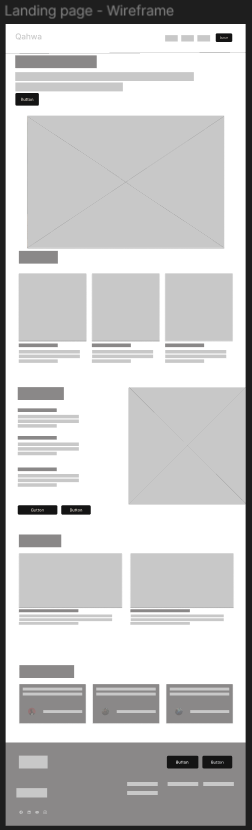

### 4.3.2. Landing Page Mockup

  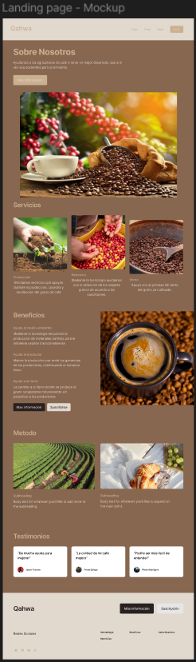

## 4.4. Web Applications UX/UI Design

### 4.4.1. Web Applications Wireframes

  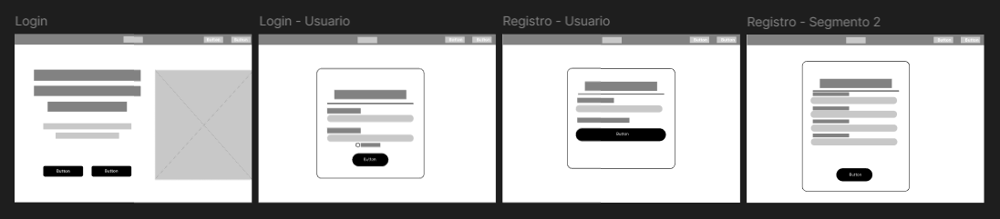

  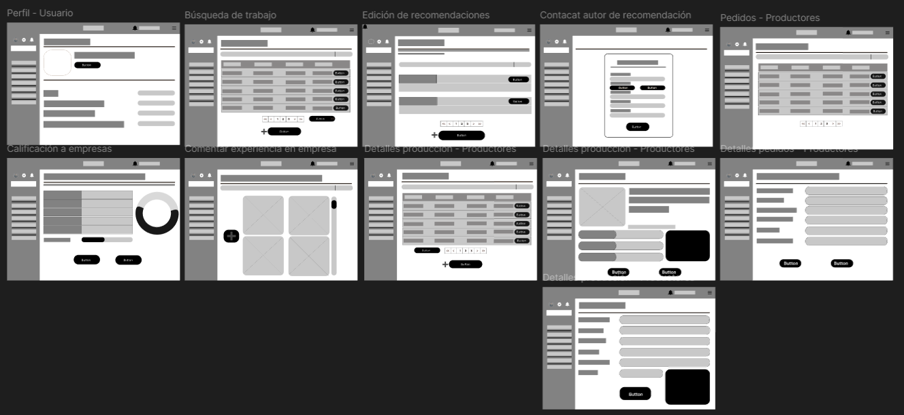

  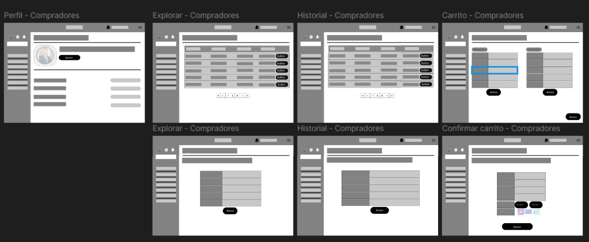

### 4.4.2. Web Applications Wireflow Diagrams

  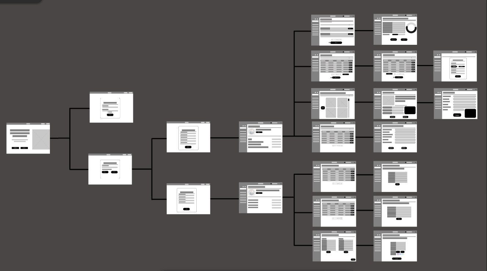

### 4.4.2. Web Applications Mock-ups

  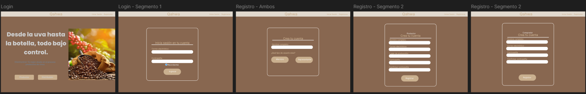

  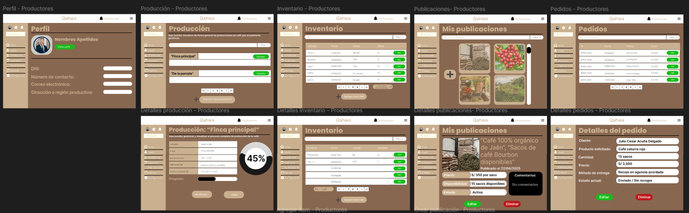

  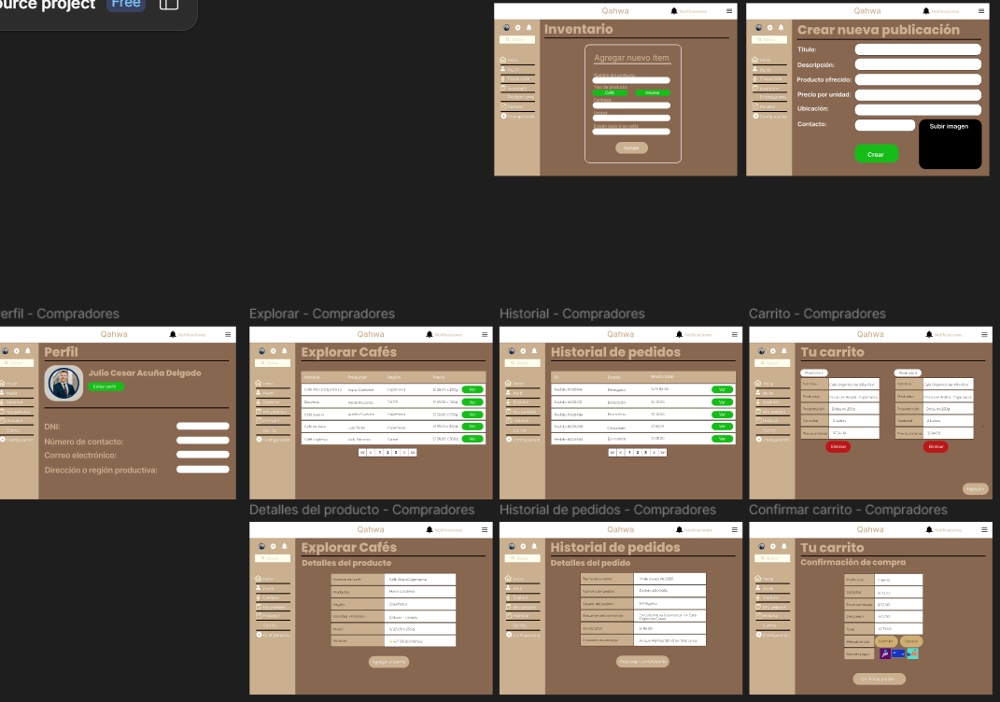

### 4.4.3. Web Applications User Flow Diagrams

  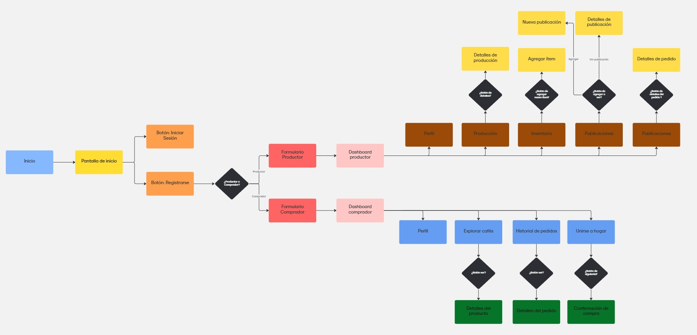

## 4.5. Web Applications Prototyping

En esta sección se presentan los prototipos de las aplicaciones web tanto para vista de escritorio como para dispositivos móviles, desarrollados con base en los flujos definidos en los *User Flow Diagrams*. Estos prototipos simulan la experiencia de navegación e interacción que tendrán los usuarios, permitiendo validar la usabilidad de la interfaz, la arquitectura de la información y la efectividad del sistema de navegación planteado.

Los criterios que guiaron las decisiones de interacción están centrados en ofrecer una experiencia fluida, intuitiva y coherente entre todas las plataformas. Se priorizó la accesibilidad, la facilidad de uso y la estética funcional, siguiendo los principios del diseño centrado en el usuario.

Las decisiones aquí evidencian la aplicación de la arquitectura de información previamente desarrollada, en especial en lo que respecta al sistema de navegación (*Navigation Systems*), la estructura jerárquica del contenido (*Organization Systems*) y los sistemas de búsqueda integrados (*Searching Systems*).

Además, se ha diseñado un sistema de diseño responsivo que adapta los elementos visuales y de interacción según el tipo de dispositivo, garantizando una experiencia consistente y optimizada tanto en computadoras como en móviles.

## 4.6. Domain-Driven Software Architecture

### 4.6.1. Software Architecture Context Diagram

  

### 4.6.2. Software Architecture Container Diagrams

  

### 4.6.3. Software Architecture Components Diagrams

  

## 4.7. Software Object-Oriented Design

### 4.7.1. Class Diagrams

  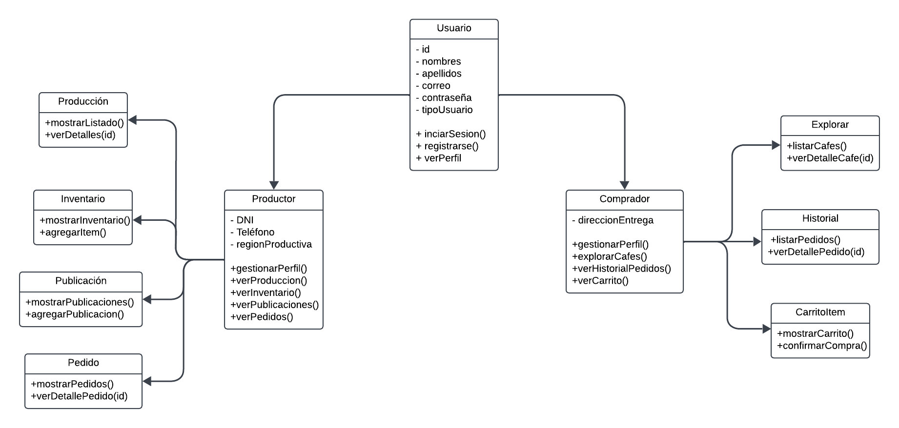

### 4.7.2. Class Dictionary

| Clase         | Atributos                                       | Métodos principales |
|---------------|--------------------------------------------------|----------------------|
| **Usuario**     | id, nombres, apellidos, correo, contraseña, tipo | iniciarSesion(), registrarse(), verPerfil() |
| **Productor**   | dni, telefono, region                            | gestionarPerfil(), verProduccion(), verInventario(), verPublicaciones(), verPedidos() |
| **Comprador**   | direccionEntrega                                  | gestionarPerfil(), explorarCafes(), verHistorialPedidos(), verCarrito() |
| **ProduccionUI** | ---                                             | mostrarListado(), verDetalles(id) |
| **InventarioUI** | ---                                             | mostrarInventario(), agregarItem() |
| **PublicacionesUI** | ---                                         | mostrarPublicaciones(), agregarPublicacion() |
| **PedidosUI**   | ---                                              | mostrarPedidos(), verDetallePedido(id) |
| **ExplorarUI**  | ---                                              | listarCafes(), verDetalleCafe(id) |
| **HistorialUI** | ---                                              | listarPedidos(), verDetallePedido(id) |
| **CarritoUI**   | ---                                              | mostrarCarrito(), confirmarCompra() |

---

## 4.8. Database Design

  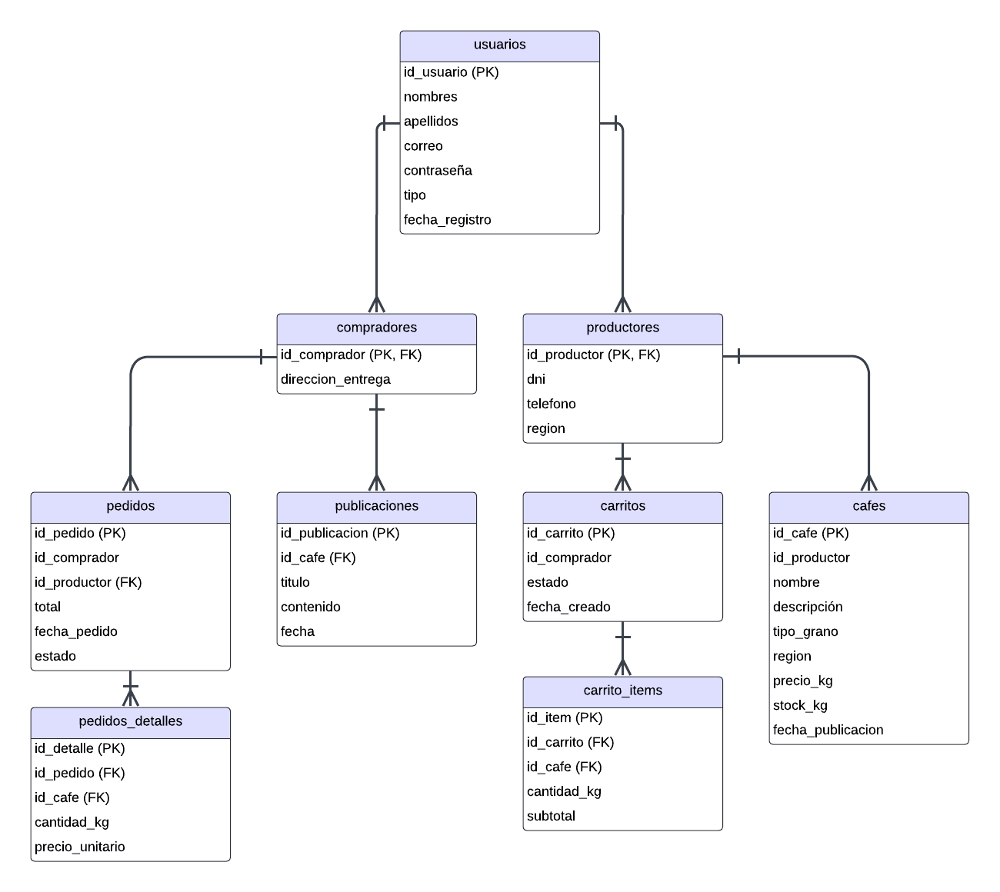

#### USUARIOS

| Campo           | Tipo       | Descripción                     |
|------------------|------------|----------------------------------|
| id_usuario       | INT (PK)   | Identificador único              |
| nombres          | VARCHAR    | Nombres del usuario              |
| apellidos        | VARCHAR    | Apellidos                        |
| correo           | VARCHAR    | Correo electrónico               |
| contraseña       | VARCHAR    | Contraseña cifrada               |
| tipo             | ENUM       | 'productor' o 'comprador'        |
| fecha_registro   | DATETIME   | Fecha de creación de la cuenta   |

#### PRODUCTORES

| Campo         | Tipo        | Descripción              |
|----------------|-------------|---------------------------|
| id_productor   | INT (PK, FK) | Relación con usuarios     |
| dni            | VARCHAR     | DNI del productor         |
| telefono       | VARCHAR     | Número de teléfono        |
| region         | VARCHAR     | Región del Perú           |

#### COMPRADORES

| Campo             | Tipo        | Descripción                        |
|--------------------|-------------|-------------------------------------|
| id_comprador       | INT (PK, FK) | Relación con usuarios               |
| direccion_entrega  | TEXT        | Dirección donde se entrega café     |

#### CAFÉS

| Campo             | Tipo       | Descripción                    |
|--------------------|------------|---------------------------------|
| id_cafe            | INT (PK)   | ID único del producto           |
| id_productor       | INT (FK)   | Relación con productores        |
| nombre             | VARCHAR    | Nombre del café                 |
| descripcion        | TEXT       | Descripción del café            |
| tipo_grano         | VARCHAR    | Ej: Arábica, Robusta, etc.      |
| region             | VARCHAR    | Región de origen                |
| precio_kg          | DECIMAL    | Precio por kilo                 |
| stock_kg           | INT        | Inventario disponible           |
| fecha_publicacion  | DATETIME   | Fecha de publicación            |

#### PUBLICACIONES

| Campo        | Tipo      | Descripción              |
|---------------|-----------|---------------------------|
| id_publicacion | INT (PK) | ID único                  |
| id_cafe        | INT (FK) | Café asociado             |
| titulo         | VARCHAR  | Título de la publicación  |
| contenido      | TEXT     | Descripción o detalles    |
| fecha          | DATETIME | Fecha de publicación      |

#### CARRITOS

| Campo         | Tipo      | Descripción                       |
|----------------|-----------|------------------------------------|
| id_carrito     | INT (PK) | ID único                           |
| id_comprador   | INT (FK) | Comprador dueño del carrito        |
| estado         | ENUM     | 'activo', 'comprado'               |
| fecha_creado   | DATETIME | Fecha de creación                  |

#### CARRITO_ITEMS

| Campo         | Tipo      | Descripción                          |
|----------------|-----------|---------------------------------------|
| id_item        | INT (PK) | ID único                              |
| id_carrito     | INT (FK) | Carrito al que pertenece              |
| id_cafe        | INT (FK) | Café agregado                         |
| cantidad_kg    | INT      | Cantidad en kg                        |
| subtotal       | DECIMAL  | Precio total por ítem                 |

#### PEDIDOS

| Campo         | Tipo      | Descripción                |
|----------------|-----------|-----------------------------|
| id_pedido      | INT (PK) | ID del pedido               |
| id_comprador   | INT (FK) | Comprador                   |
| id_productor   | INT (FK) | Productor                   |
| total          | DECIMAL  | Monto total                 |
| fecha_pedido   | DATETIME | Fecha de compra             |
| estado         | ENUM     | 'pendiente', 'enviado', 'entregado' |

#### PEDIDOS_DETALLES

| Campo           | Tipo      | Descripción                |
|------------------|-----------|-----------------------------|
| id_detalle       | INT (PK) | ID único                    |
| id_pedido        | INT (FK) | Pedido asociado             |
| id_cafe          | INT (FK) | Café vendido                |
| cantidad_kg      | INT      | Cantidad de café            |
| precio_unitario  | DECIMAL  | Precio por kilo             |

---

### Relaciones clave

- `usuarios` se relaciona con `productores` y `compradores` según su tipo.
- `productores` publican cafés, y esos cafés pueden tener publicaciones.
- `compradores` pueden explorar cafés, agregarlos a un carrito, y luego confirmar un pedido.
- `carrito_items` agrupa productos antes de confirmar un pedido.
- `pedidos` se enlazan con los cafés mediante `pedido_detalles`.

---

### 4.8.1. Database Diagram

## 5.1. Software Configuration Management

### 5.1.1. Software Development Environment Configuration

Esta sección describe las herramientas y entornos utilizados durante el desarrollo del sistema, con el objetivo de garantizar la trazabilidad, reproducibilidad y continuidad del proyecto por parte de los miembros actuales y futuros. Se han seleccionado plataformas accesibles, ampliamente adoptadas en la industria y con capacidades colaborativas, alineadas con las necesidades de un equipo multidisciplinario.

#### Project Management

**Trello** – [https://trello.com/](https://trello.com/)  
Para la gestión de tareas se empleó Trello, una herramienta basada en tableros Kanban que facilita el seguimiento visual del progreso del proyecto. Cada fase del desarrollo se organizó en listas representando los estados de avance (Por hacer, En curso, Hecho), mientras que las tareas individuales se definieron en tarjetas que permitieron asignaciones específicas, fechas límite y comentarios colaborativos. Su facilidad de uso, integración con otras herramientas (como Slack o Google Drive) y disponibilidad desde múltiples dispositivos la convirtieron en una opción efectiva para la coordinación del equipo.

#### Requirements Management

**Google Docs** – [https://docs.google.com/](https://docs.google.com/)  
Los requisitos funcionales y no funcionales del sistema fueron redactados, discutidos y validados mediante Google Docs. Su característica de edición colaborativa en tiempo real permitió que todos los miembros del equipo pudieran intervenir activamente durante las sesiones de análisis y refinamiento de requisitos, incluyendo comentarios, sugerencias y revisiones. Esta herramienta fue clave para mantener la trazabilidad de cambios y versiones durante las primeras fases del ciclo de vida del producto.

#### Product UX/UI Design

**Figma** – [https://www.figma.com/](https://www.figma.com/)  
Figma fue utilizado para el diseño de las interfaces gráficas del sistema, tanto para dispositivos desktop como móviles. Su capacidad de trabajo colaborativo permitió que los diseñadores y desarrolladores trabajaran de forma simultánea en la construcción de wireframes, prototipos interactivos y mockups finales. Gracias a su accesibilidad desde el navegador y su estructura basada en componentes reutilizables, se logró mantener coherencia visual en todas las vistas y se facilitó la validación temprana con los usuarios clave.

#### Software Development

**Visual Studio Code** – [https://code.visualstudio.com/](https://code.visualstudio.com/)  
El entorno de desarrollo elegido para la mayoría de los componentes fue Visual Studio Code, un editor de código liviano pero altamente extensible. A través de plugins como Prettier, ESLint y GitLens, se logró mantener un estilo de código coherente, identificar errores de forma anticipada y gestionar versiones directamente desde el editor. Su compatibilidad con HTML, CSS, JavaScript y frameworks modernos permitió una integración fluida de todas las tecnologías empleadas.

##### Landing Page (HTML/CSS/JS con Tailwind CSS)

La Landing Page fue desarrollada utilizando HTML5, CSS3 y JavaScript Vanilla, apoyados por el framework Tailwind CSS para lograr un diseño responsive y moderno. La simplicidad de esta arquitectura permitió una rápida implementación, optimización de tiempos de carga y compatibilidad con dispositivos móviles y de escritorio.

##### Frontend Web App (Framework: React)

Para la aplicación principal de interacción con el usuario se utilizó React, una biblioteca de JavaScript especializada en la construcción de interfaces reactivas. Su estructura basada en componentes permitió una mayor reutilización de código y modularidad. El entorno de desarrollo también se centralizó en Visual Studio Code, incluyendo la configuración de ESLint para asegurar buenas prácticas de programación.

##### RESTful Web Services (Framework: .NET Core)

El backend fue construido con ASP.NET Core, utilizando C# para el desarrollo de APIs RESTful. Este framework fue seleccionado por su robustez, escalabilidad y capacidad de integración con servicios en la nube. Para su implementación y prueba se utilizó Postman, mientras que el desarrollo se llevó a cabo en Visual Studio 2022 y Visual Studio Code, dependiendo del componente.

#### API Testing & Documentation

**Postman** – [https://www.postman.com/](https://www.postman.com/)  
Postman fue empleado para probar de forma manual los servicios RESTful, validar los endpoints y verificar la autenticidad y seguridad de las respuestas del servidor. Las colecciones creadas fueron compartidas entre los miembros del equipo para garantizar pruebas estandarizadas y facilitar la detección de errores en los flujos de integración.

**Swagger UI** – [https://swagger.io/tools/swagger-ui/](https://swagger.io/tools/swagger-ui/)  
Para documentar las APIs de forma automática y legible, se integró Swagger UI con los controladores del backend. Esto permitió generar una interfaz web navegable que expone los endpoints disponibles, sus métodos, parámetros y respuestas esperadas, facilitando así el trabajo de los desarrolladores frontend y terceros interesados.

#### Software Deployment

**Firebase Hosting** – [https://firebase.google.com/](https://firebase.google.com/)  
Firebase se utilizó como plataforma de despliegue para la Landing Page y la aplicación frontend, debido a su rapidez de configuración, integración continua mediante CLI y capacidad de alojamiento de sitios estáticos y dinámicos. Su panel de administración intuitivo y sus herramientas para pruebas previas al despliegue facilitaron un flujo de trabajo ágil y seguro.

**Azure App Services** – [https://azure.microsoft.com/](https://azure.microsoft.com/)  
Los servicios backend fueron desplegados utilizando Azure App Services, permitiendo escalar automáticamente según la demanda, gestionar configuraciones del entorno y controlar el estado de las instancias en producción. Además, se integró con GitHub Actions para habilitar flujos de CI/CD (Integración y Despliegue Continuos).

### 5.1.2. Source Code Management

Para gestionar eficientemente el código fuente del sistema y asegurar una colaboración estructurada entre los desarrolladores, se ha empleado **Git** como sistema de control de versiones distribuido, en conjunto con la plataforma **GitHub** para el alojamiento remoto de los repositorios. Esta combinación ha permitido un desarrollo ordenado, seguimiento de cambios precisos y una gestión clara del ciclo de vida del software.

#### Repositorios utilizados

Se han creado repositorios independientes para cada uno de los módulos principales del sistema, lo cual permite una organización modular del proyecto, facilita el mantenimiento y reduce la complejidad en futuras integraciones:

- **Frontend Web Application**: [https://github.com/tu-usuario/frontend-app.git](https://github.com/tu-usuario/frontend-app.git)  
  Contiene el código fuente de la interfaz de usuario principal desarrollada con React, así como los componentes visuales y lógica del cliente.

- **Landing Page**: [https://github.com/tu-usuario/landing-page.git](https://github.com/tu-usuario/landing-page.git)  
  Repositorio dedicado a la página de presentación del sistema, construida con HTML, Tailwind CSS y JavaScript.

- **Backend API**: [https://github.com/tu-usuario/backend-api.git](https://github.com/tu-usuario/backend-api.git)  
  Repositorio donde se encuentra la lógica del servidor, desarrollado en ASP.NET Core y expuesto mediante servicios RESTful.

- **Documentación Técnica y Reporte Final**: [https://github.com/tu-usuario/documentacion-proyecto.git](https://github.com/tu-usuario/documentacion-proyecto.git)  
  Contiene los entregables del proyecto, documentación técnica, manuales de usuario, y demás archivos asociados al desarrollo formal del producto.

#### Modelo de ramas implementado

Para mantener una estructura clara en el flujo de desarrollo, se ha adoptado un modelo de ramas inspirado en **GitFlow**. Esta metodología permite separar el trabajo en curso del código estable en producción, facilitando el trabajo en paralelo y las futuras integraciones:

- **main**: Rama principal que contiene la última versión estable del sistema, lista para producción.
- **dev**: Rama de integración donde se unifican los avances de todas las funcionalidades antes de ser probadas y fusionadas a producción.
- **feature/{nombre}**: Ramas creadas para el desarrollo de funcionalidades específicas del sistema. Ejemplo: `feature/registro-usuarios`.
- **release/{version}**: Utilizadas para preparar lanzamientos formales. Incluyen ajustes finales, pruebas de integración y documentación antes de llegar a main. Ejemplo: `release/1.1.0`.
- **hotfix/{detalle}**: Ramas de corrección inmediata sobre producción, aplicadas directamente desde main. Ejemplo: `hotfix/error-login-infinito`.

#### Estrategia de commits y versionado

Para asegurar un historial limpio y comprensible, se han seguido las siguientes convenciones:

##### Versionado semántico (SemVer)

Se ha adoptado el esquema **X.Y.Z**, donde:

- **X (Major)**: Se incrementa cuando hay cambios incompatibles con versiones anteriores.
- **Y (Minor)**: Se incrementa al agregar nuevas funcionalidades que mantienen compatibilidad.
- **Z (Patch)**: Se incrementa en caso de corrección de errores sin afectar la funcionalidad.

##### Mensajes de commit estructurados (Conventional Commits)

Se siguen etiquetas estandarizadas que indican el tipo de cambio, lo que facilita la revisión y generación automática de changelogs. Algunos ejemplos usados en el proyecto:

- **feat**: Incorporación de una nueva funcionalidad.
- **fix**: Corrección de un bug o problema detectado.
- **docs**: Modificaciones relacionadas a documentación.
- **style**: Cambios de formato o estilo sin impacto en la lógica.
- **refactor**: Reestructuración del código sin alterar el comportamiento externo.
- **test**: Incorporación o modificación de pruebas automatizadas.

Este enfoque integral ha permitido que el desarrollo avance de manera colaborativa, ordenada y sostenible, minimizando conflictos y facilitando futuras ampliaciones o mantenimiento del sistema.

### 5.1.3. Source Code Style Guide & Conventions

Con el objetivo de mantener un código legible, organizado y fácil de mantener a lo largo del desarrollo del sistema, se han definido y seguido una serie de convenciones de estilo específicas para cada una de las tecnologías utilizadas. Estas prácticas buscan no solo facilitar la colaboración entre los integrantes del equipo, sino también asegurar la escalabilidad del proyecto y una buena experiencia para futuros desarrolladores que trabajen sobre el mismo código base.

#### HTML

- **Etiquetas correctamente cerradas**: Todas las etiquetas deben ser explícitamente cerradas para evitar errores de renderizado o malformaciones del DOM.
  Ejemplo: `<section class="features"></section>`

- **Uso de minúsculas en etiquetas y atributos**: Tanto los nombres de etiquetas como sus atributos deben escribirse en minúsculas.
  Ejemplo: ``

- **Atributos entre comillas dobles**: Todos los valores de atributos deben ir entre comillas dobles para mantener uniformidad.
  Ejemplo: `<a href="#contacto" class="link-seccion">Contáctanos</a>`

- **Buenas prácticas con imágenes**: Se emplea `alt`, `width` y `height` para mejorar la accesibilidad y optimizar el tiempo de carga.
  Ejemplo: ``

#### CSS / Tailwind CSS

- **Clases descriptivas y consistentes**: Se priorizan nombres de clases comprensibles al momento de usar estilos personalizados o aplicar utilidades.
  Ejemplo (Tailwind): `class="bg-gray-100 text-center p-4 rounded-md"`

- **Separación por guiones medios**: Se mantiene el formato `kebab-case` para los nombres de clases personalizadas.
  Ejemplo: `.card-producto`, `.form-registro`

- **Evitar redundancias**: No se especifican unidades para valores de cero (por ejemplo, `margin: 0;` en lugar de `margin: 0px;`).

- **Orden lógico en los estilos**: En los componentes Vue que contienen estilos embebidos, se sigue un orden coherente agrupando propiedades relacionadas (layout, tipografía, colores, etc.).

#### JavaScript (Vanilla y Vue 3)

- **Uso de const y let según el contexto**: Se prefiere `const` para valores inmutables y `let` para aquellos que requieren reasignación.

- **Nombres de variables claros y expresivos**: Las variables deben describir su contenido o propósito.
  Ejemplo: `nombreUsuario`, `listaGastos`, `montoTotal`

- **Modularidad del código**: Se evita la creación de funciones anidadas innecesarias, dividiendo el código en funciones reutilizables.

- **Callbacks y promesas correctamente manejadas**: Se usa `async/await` en lugar de `.then()` cuando es posible, para mejorar la legibilidad.

- **Eventos del DOM correctamente enlazados**: En componentes Vue, se siguen las buenas prácticas del framework para eventos, uso de `v-on`, `@click`, etc.

#### Vue 3 + Vite

- **Nombres de componentes en PascalCase**: Tanto en archivos como dentro del código, los componentes Vue siguen la convención PascalCase.
  Ejemplo: `GastoItem.vue`, `FormularioRegistro.vue`

- **Carpetas organizadas por responsabilidad**: Se agrupan componentes, vistas y servicios en directorios específicos, manteniendo una estructura modular.

- **Directivas y bindings bien estructurados**: Se utilizan correctamente las directivas de Vue como `v-for`, `v-if`, `v-model`, asegurando claridad y eficiencia.

- **Separación en bloques template, script y style**: Cada componente `.vue` debe tener bien diferenciadas sus secciones. Si el CSS es específico, se utiliza el atributo `scoped`.

- **Uso de Composition API**: En la medida de lo posible, se ha adoptado la Composition API por su flexibilidad, manteniendo el código más estructurado, especialmente en componentes complejos.

#### JSON

- **Formato limpio y validado**: Todos los archivos `.json` utilizados (por ejemplo, para configuraciones o datos simulados) siguen un formato legible, validado y con indentación de 2 espacios.

- **Claves en minúsculas y con guiones bajos si es necesario**: Se usa `camelCase` o `snake_case` dependiendo del contexto del archivo.

Estas guías han sido fundamentales para mantener la coherencia en todo el proyecto, facilitar el trabajo en equipo y garantizar que el código se mantenga sostenible y escalable a lo largo del tiempo. Además, se han revisado de forma regular durante el desarrollo para asegurar su cumplimiento por parte de todos los miembros del equipo.

### 5.1.4. Software Deployment Configuration

El proceso de despliegue del sistema ha sido diseñado para garantizar disponibilidad, rapidez en la entrega de nuevas versiones y facilidad de mantenimiento. Cada componente cuenta con una configuración de despliegue específica, utilizando servicios modernos de hosting con soporte para integración continua.

#### Landing Page

- **Plataforma de despliegue**: Vercel
- **Configuración**: El proyecto se encuentra vinculado directamente al repositorio de GitHub, permitiendo un despliegue automático con cada cambio en la rama `main`. Esto asegura que las actualizaciones estén disponibles inmediatamente después de ser validadas.

#### Aplicación Web Principal (Vue 3 + Vite)

- **Plataforma de despliegue**: Vercel
- **Configuración**: Se ha configurado el entorno con soporte para rutas personalizadas y adaptado a las características del enrutador de Vue. El despliegue ocurre de manera automática tras realizar un push a la rama `main`, manteniendo el sitio actualizado de forma continua.

#### Consumo de datos (APIs simuladas o externas)

- **Plataforma**: Entorno local o servicios externos según el entorno de pruebas
- **Configuración**: Durante el desarrollo se ha hecho uso de servicios mockeados o simulados en formato JSON. En una versión futura, el sistema podrá conectarse a un backend real siguiendo principios REST o GraphQL, según sea requerido.

Gracias al uso de Vercel y la integración directa con GitHub, se ha logrado establecer un flujo de trabajo CI/CD que permite al equipo desplegar nuevas versiones del frontend de forma rápida, eficiente y segura, sin necesidad de realizar procesos manuales.

## 5.2. Landing Page, Services & Applications Implementation

### 5.2.1. Sprint 1

En esta primera etapa del proyecto, el equipo se centró en la implementación inicial del Landing Page del sistema web. Esta interfaz actúa como puerta de entrada tanto para productores como consumidores interesados en el café de origen. El desarrollo se realizó utilizando tecnologías modernas (Angular y Vercel) y se priorizó la experiencia de usuario, así como la presentación de la propuesta de valor del sistema.  
Durante este sprint, se implementó la estructura básica de la landing page, que incluye un encabezado con navegación, secciones informativas y un footer con enlaces de interés y opción de suscripción.  
A continuación, se detalla la planificación y el backlog trabajado.

---

#### 5.2.1.1. Sprint Planning 1

En esta planificación se acordó trabajar exclusivamente en el Landing Page, dado que representa el primer punto de contacto del usuario con el sistema. Se definieron las siguientes tareas principales:

- Implementación del encabezado con logo y botones de navegación hacia las secciones: **Inicio**, **Sobre Nosotros**, **Servicios**, **Beneficios**, **Método**, **Testimonios**.
- Desarrollo del footer, el cual contiene enlaces a más información y un formulario para suscripción.
- Diseño responsivo básico que asegure una correcta visualización en diferentes dispositivos.
- Despliegue automático en Vercel, conectado al repositorio de GitHub.

Se asignaron tiempos estimados para cada tarea y responsabilidades dentro del equipo.

#### 5.2.1.2. Aspect Leaders and Collaborators

#### 5.2.1.3. Sprint Backlog 1

| **User Story** | **Título**    | **ID**  | **Tarea**                   | **Descripción**                                                  | **Estimación (Horas)** | **Asignado a**          | **Estado** |
|----------------|---------------|---------|-----------------------------|------------------------------------------------------------------|------------------------|-------------------------|------------|
| US-001         | Landing Page  | T001    | Estructura del encabezado    | Implementar el encabezado con logo y botones de navegación entre secciones. | 3                      | [Nombre del integrante] | Done       |
| US-001         | Landing Page  | T002    | Desarrollo del footer        | Implementar el pie de página con enlaces útiles y formulario de suscripción. | 3                      | [Nombre del integrante] | Done       |
| US-001         | Landing Page  | T003    | Diseño responsivo y estilos  | Aplicar estilos generales y adaptar diseño a dispositivos móviles y escritorio. | 3                      | [Nombre del integrante] | Done       |
| US-001         | Landing Page  | T004    | Configuración de despliegue  | Configurar despliegue automático del sitio en Vercel con integración a GitHub. | 2                      | [Nombre del integrante] | Done       |

#### 5.2.1.4. Development Evidence for Sprint Review

#### 5.2.1.5. Execution Evidence for Sprint Review

Durante este Sprint, nos enfocamos en la creación y diseño de la Landing Page de nuestra aplicación Qahwa, utilizando HTML como base tecnológica. El objetivo fue construir una interfaz de bienvenida moderna, clara y responsiva que introduzca al usuario al sistema y le brinde acceso directo a las secciones principales de la plataforma.
El diseño se orientó a facilitar la navegación y destacar el propósito del sistema, aplicando buenas prácticas de usabilidad e identidad visual coherente con la temática de control de producción. Las vistas desarrolladas incluyen el encabezado con logotipo y botones de navegación, el cuerpo con un mensaje de presentación, y un pie de página funcional que contiene enlaces útiles.
A continuación, se presentan capturas de pantalla que muestran el avance y los elementos visuales implementados:

#### 5.2.1.6. Services Documentation Evidence for Sprint Review

#### 5.2.1.7. Software Deployment Evidence for Sprint Review

Durante el desarrollo de este Sprint nuestro equipo logró desarrollar como forma inicial la Landing Page de nuestra startup llamada Qahwa. A lo largo del trabajo se ha logrado desarrollar el proyecto de manera efectiva y llevar un control de versiones de manera adecuada. Para garantizar todo esto se utilizaron las siguientes herramientas:

- **Git**: Este sistema de control de versiones nos permitió distribuir y gestionar los cambios del proyecto de manera segura y eficiente.
- **GitHub**: Este sistema nos facilitó el trabajo colaborativo, con el uso de ramas, control de versiones y revisión de código entre miembros del equipo.
- **GitFlow**: Gracias a este modelo pudimos trabajar de manera organizada y permitiendo un flujo de desarrollo ordenado y controlado.

Por el momento nuestro proyecto está en fase primitiva, en constante desarrollo y haciendo pruebas locales. En futuros sprints se considerará el despliegue de la plataforma en forma adecuada.

#### 5.2.1.8. Team Collaboration Insights during Sprint

Se buscó trabajar de manera colaborativa usando ramas en GitHub para cada tarea del proyecto.

Se gestionaron pull requests, revisiones de código y asignación de tareas para facilitar la organización y la correcta comunicación del equipo.

